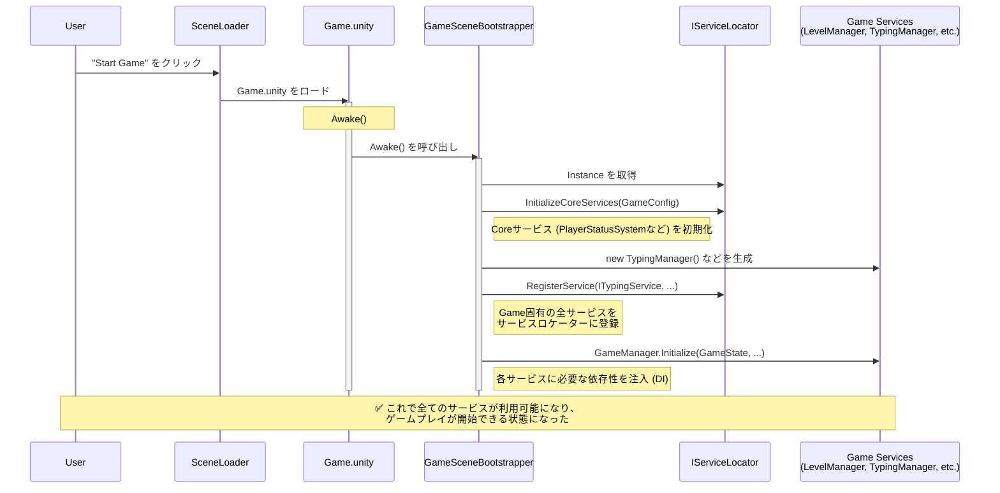

# **アプリケーションのライフサイクルと初期化フロー**

このドキュメントは、`Typing Survivor`が起動してから、プレイヤーがゲームを操作できるようになるまでの、オブジェクトとシステムの初期化シーケンスを定義します。

## **1. 設計思想**

本プロジェクトの初期化は、以下の原則に基づいています。

*   **単一の起動点:** ゲームは必ず `App.unity` シーンから起動され、ゲーム全体で永続する必須サービス (`AppManager`など) を最初に初期化します。これにより、どのシーンでもこれらのサービスが利用可能であることが保証されます。
*   **責務の分離:**
    *   `AppManager` は、サービスを保持する汎用的な「箱」（サービスロケーター）としての責務に特化します。
    *   各シーンの具体的な初期化ロジックは、そのシーンのエントリーポイント（`GameSceneBootstrapper`など）が担当します。これを **Composition Root (構成の起点)** と呼びます。

## **2. シーン遷移フロー**

アプリケーションは、以下の順序でシーンを遷移します。

1.  **`App.unity` (初期化シーン):**
    *   `AppManager` を起動し、`DontDestroyOnLoad` に設定します。
    *   Unity Gaming Services (UGS) などの低レベルな初期化を行います。
    *   完了後、自動的に `MainMenu.unity` へ遷移します。

2.  **`MainMenu.unity` (メインメニュー):**
    *   プレイヤーの認証やゲーム開始のUIを提供します。
    *   "Start Game" ボタンなどが押されると、`Game.unity` へ遷移します。

3.  **`Game.unity` (ゲーム本編):**
    *   実際のゲームプレイが行われるシーンです。
    *   このシーンがロードされると、`GameSceneBootstrapper` が起動し、ゲームプレイに必要なすべてのサービスを初期化・登録します。

## **3. ゲームシーンの初期化シーケンス**

`Game.unity` がロードされた際の、詳細な初期化フローは以下の通りです。

