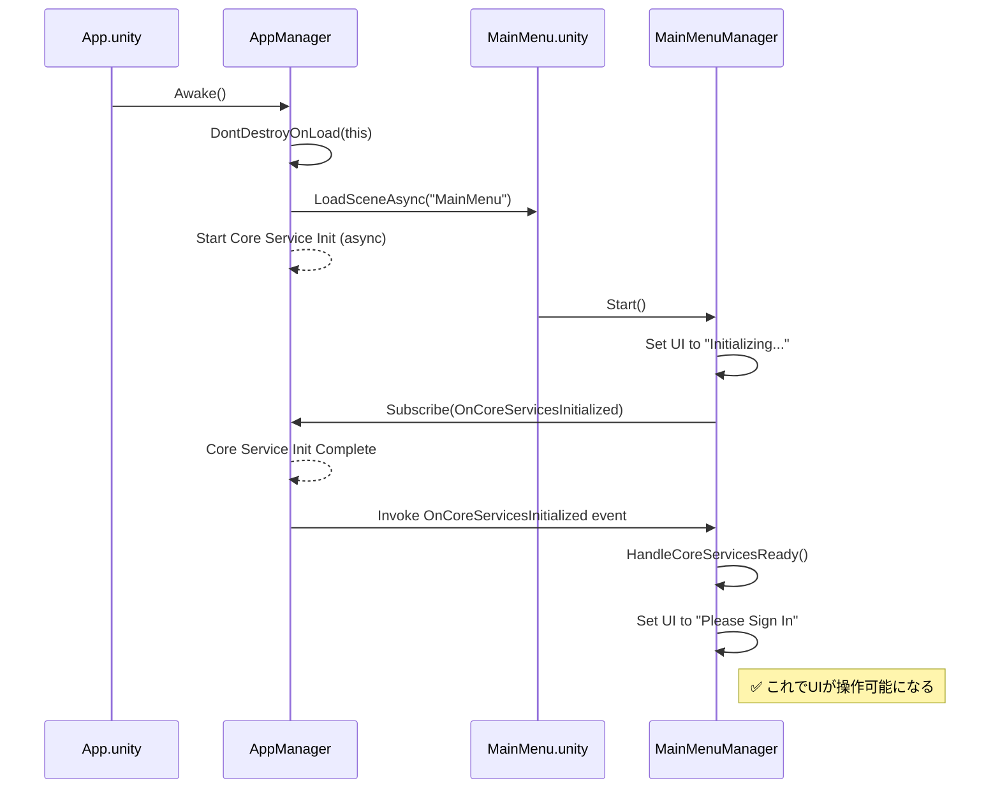
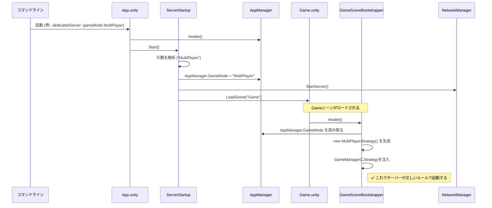

# **アプリケーションのライフサイクルと初期化フロー**

このドキュメントは、`Typing Survivor`が起動してから、プレイヤーがゲームを操作できるようになるまでの、オブジェクトとシステムの初期化シーケンスを定義します。

## **1. 設計思想**

本プロジェクトの初期化は、以下の原則に基づいています。

*   **単一の起動点:** ゲームは必ず `App.unity` シーンから起動されます。このシーンは、`AppManager`や`NetworkManager`といった、アプリケーション全体で永続する必須オブジェクトを生成する責務を持ちます。
*   **迅速なUI表示と非同期初期化:** ユーザーを待たせないため、`App`シーンは起動後、即座に`MainMenu.unity`シーンのロードを開始します。Unity Gaming Services (UGS) の認証サービスといった時間のかかる初期化処理は、シーン遷移と並行してバックグラウンドで非同期に実行されます。
*   **イベント駆動の連携:** `AppManager`は、コアサービスの初期化が完了したことを`OnCoreServicesInitialized`イベントで通知します。`MainMenuManager`のようなUI側のクラスはこのイベントを購読し、準備が整ったタイミングでUIを操作可能な状態に更新します。

## **2. シーン遷移フロー**

1.  **`App.unity` (初期化シーン):**
    *   `AppManager`と`NetworkManager`を起動し、`DontDestroyOnLoad`に設定します。
    *   **即座に** `MainMenu.unity` へのシーン遷移を開始します。
    *   **並行して**、UGSや`AuthService`の非同期初期化を開始します。

2.  **`MainMenu.unity` (メインメニュー):**
    *   `MainMenuManager`が起動し、UIを「初期化中...」の状態で表示します。
    *   `AppManager`からの`OnCoreServicesInitialized`イベントを待ち受けます。
    *   イベント受信後、UIを更新し、プレイヤーがサインインやゲーム開始を選択できるようになります。

3.  **`Game.unity` (ゲーム本編):**
    *   `MainMenuManager`でゲーム開始が選択されると、このシーンへ遷移します。
    *   `GameSceneBootstrapper`が起動し、ゲームプレイに必要なサービスを初期化・登録します。

## **3. クライアント起動時の初期化シーケンス**

## **4. 専用サーバー起動時の初期化シーケンス**

専用サーバーは、コマンドライン引数によって `MainMenu` シーンをスキップし、直接 `Game` シーンを起動します。

