# **アーキテクチャ概要**

## **1\. コア原則**

このプロジェクトの全ての設計は、以下の2つの原則に基づいています。

### **1.1. 疎結合 (Loose Coupling)**

各機能（Player, Item, Level...）は、他の機能の具体的な実装を知るべきではありません。コミュニケーションは、事前に定められた\*\*インターフェース（契約）\*\*を通じてのみ行われます。

* **目的**:  
  * ある機能の変更が、他の機能へ予期せぬ影響を与えることを防ぐ。  
  * 機能単位でのテストを容易にする。  
  * 必要に応じて、ある機能の実装を別のものに差し替えること（例: PerlinNoiseMapGeneratorをCaveMapGeneratorに）を可能にする。  
* **実現手段**:  
  * DI (Dependency Injection / 依存性の注入)  
  * イベント駆動アーキテクチャ

### **1.2. 関心の分離 (Separation of Concerns)**

一つのクラスは、一つの責任だけを持つべきです。例えば、Player機能は、「入力受付」「状態管理」「見た目の更新」「ネットワーク同期」といった異なる関心事を、それぞれ専門のクラスに分割して担当させます。

* **目的**:  
  * クラスの役割を明確にし、コードの見通しを良くする。  
  * 変更が必要な際に、修正すべき箇所を最小限に留める。  
* **実現手段**:  
  * Facade, State, Strategyなどの各種設計パターン  
  * 機能（Feature）ベースのフォルダ構造

## **2\. システム構成図**

このアーキテクチャは、**サーバー権威（Server-Authoritative）モデル**を基本とします。全てのゲームロジックの決定権はサーバーが持ち、クライアントは入力の送信と、サーバーから送られてきた状態の描画に専念します。

[client-server architecture diagramの画像](./docs/client-server-model.jpg)

```mermaid
graph TD  
    subgraph Client  
        C_Input[PlayerInput] --> C_Facade[PlayerFacade];  
        C_Facade -- ServerRpc --> S_Facade;  
        S_Facade -- NetworkVariable/ClientRpc --> C_Facade;  
        C_Facade --> C_View[PlayerView/UI];  
    end
    
    subgraph Server  
        S_Facade[PlayerFacade] --> S_Services[各種サービス<br>IItemService, ILevelService...];  
        S_Services --> S_GameState[ゲーム状態<br>GameManager, LevelManager...];  
        S_GameState --> S_Facade;  
    end

    style C_Input fill:#000000  
    style S_Services fill:#000000
```

* **クライアント**: PlayerInputがユーザーの入力を検知し、PlayerFacadeに伝えます。  
* **通信 (Client \-\> Server)**: PlayerFacadeは入力を\[ServerRpc\]に変換し、サーバーに処理を要求します。  
* **サーバー**: サーバー側のPlayerFacadeがRPCを受け取り、IItemServiceやILevelServiceなどの専門サービスに処理を依頼します。  
* **通信 (Server \-\> Client)**: サービスによって変更されたゲームの状態（プレイヤーの位置、HP、マップのタイルなど）は、NetworkVariableやNetworkListを通じて、自動的に全クライアントに同期されます。必要に応じて\[ClientRpc\]で演出などを命令します。  
* **描画**: クライアント側のPlayerFacadeは、同期された状態を受け取り、PlayerViewやUIの表示を更新します。

## **3\. 主要な設計パターン**

本プロジェクトでは、上記の原則を実現するために以下の設計パターンを積極的に採用します。

* **DI (依存性の注入)**: クラスが必要とする依存関係（他のクラスのインスタンス）を、外部から注入する手法。手動DI、あるいはDIコンテナを用いて実現し、クラス間の疎結合を促進します。  
* **ストラテジーパターン**: アルゴリズム（マップ生成、アイテム効果など）をクラスとして切り出し、実行時に動的に差し替えられるようにします。拡張性が劇的に向上します。  
* **ステートパターン**: オブジェクトの状態（プレイヤーの待機中、移動中、タイピング中など）をクラスとして表現し、状態遷移のロジックをカプセル化します。  
* **イベント駆動**: あるシステムが状態を変更した後、その事実をイベントとして発行（Publish）し、他のシステムがそれを購読（Subscribe）するモデル。システム間の直接的な依存をなくします。  
* **CQRS (コマンド・クエリ責務分離)** の思想: システムへの命令（書き込み/Command）と、情報の取得（読み取り/Query）をインターフェースレベルで明確に分離します（WriterとReader）。これにより、意図しない状態変更を防ぎ、システムの安全性を高めます。

**全体のドキュメント:**　[README.md](./README.md)
**次のドキュメント:** [Folder-Structure.md](./Folder-Structure.md)