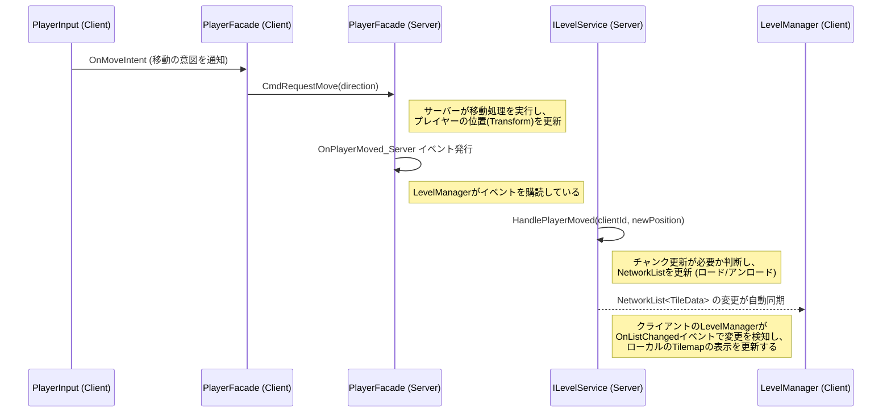
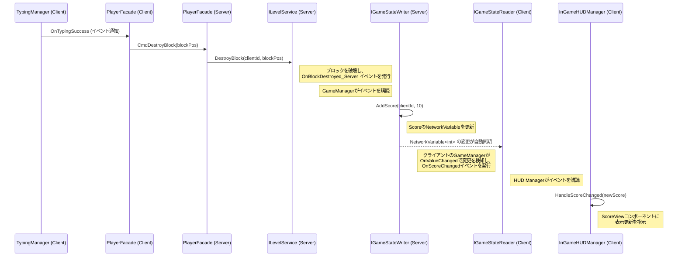

# **データフローの例**

このドキュメントでは、本アーキテクチャにおける代表的な処理が、どのようにシステム間を連携して実行されるかをシーケンス図を用いて解説します。

これにより、各機能がインターフェースを通じてどのように疎結合に連携しているかを具体的に理解することができます。

## **1\. フロー①：プレイヤーが移動し、チャンクが更新される**

プレイヤーの入力が、サーバーサイドのチャンク更新ロジックに繋がり、最終的にクライアントの表示に反映されるまでの流れです。

## **2\. フロー②：タイピングでブロックを破壊し、スコアが加算され、UIが更新される**

クライアントのタイピング成功が、サーバーでのブロック破壊とスコア加算に繋がり、その結果がクライアントのUIに反映されるまでの一連の流れです。

**全体のドキュメント:**　[README.md](./README.md)
**次のドキュメント:** [Gameplay-Design.md](./Features/Game/Gameplay/Gameplay-Design.md) (各機能詳細設計へ)