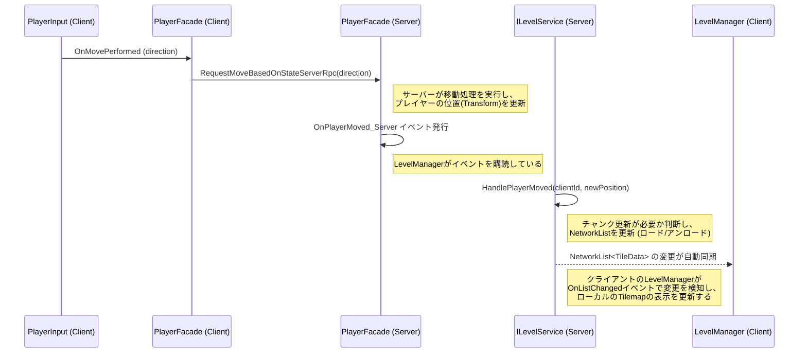
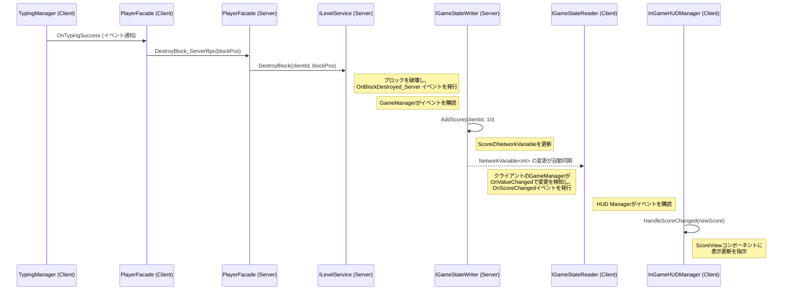
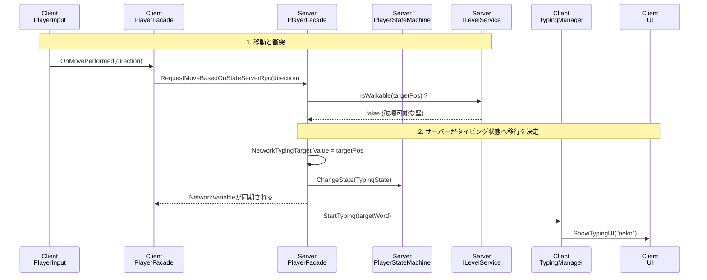
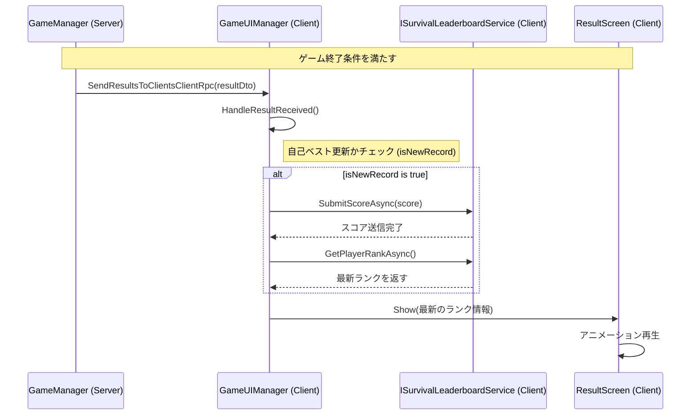
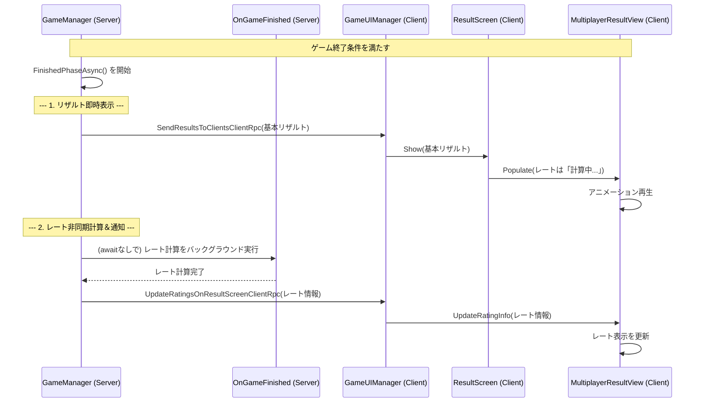

# **ゲームプレイ中のデータフロー**

このドキュメントでは、**ゲームプレイ中**に発生する代表的な処理が、どのようにシステム間を連携して実行されるかを解説します。

アプリケーション全体の起動シーケンスや、各サービスがどのように初期化・登録されるかについては、[**Application-Lifecycle.md**](./Application-Lifecycle.md) を参照してください。ここに記載されているフローは、その初期化がすべて完了していることを前提とします。

これにより、各機能がインターフェースを通じてどのように疎結合に連携しているかを具体的に理解することができます。

## **1\. フロー①：プレイヤーが移動し、チャンクが更新される**

プレイヤーの入力が、サーバーサイドのチャンク更新ロジックに繋がり、最終的にクライアントの表示に反映されるまでの流れです。

```mermaid
sequenceDiagram  
    participant C_Input as PlayerInput (Client)  
    participant C_Facade as PlayerFacade (Client)  
    participant S_Facade as PlayerFacade (Server)  
    participant S_Level as ILevelService (Server)
    participant C_Level as LevelManager (Client)

    C_Input->>C_Facade: OnMovePerformed (direction)
    C_Facade->>S_Facade: RequestMoveBasedOnStateServerRpc(direction)
    note right of S_Facade: サーバーが移動処理を実行し、<br>プレイヤーの位置(Transform)を更新  
      
    S_Facade->>S_Facade: OnPlayerMoved_Server イベント発行  
    note left of S_Level: LevelManagerがイベントを購読している  
    S_Level->>S_Level: HandlePlayerMoved(clientId, newPosition)  
    note right of S_Level: チャンク更新が必要か判断し、<br>NetworkListを更新 (ロード/アンロード)

    S_Level-->>C_Level: NetworkList<TileData> の変更が自動同期  
    note left of C_Level: クライアントのLevelManagerが<br>OnListChangedイベントで変更を検知し、<br>ローカルのTilemapの表示を更新する
```
## **2\. フロー②：タイピングでブロックを破壊し、スコアが加算され、UIが更新される**

クライアントのタイピング成功が、サーバーでのブロック破壊とスコア加算に繋がり、その結果がクライアントのUIに反映されるまでの一連の流れです。

```mermaid
sequenceDiagram  
    participant C_Typing as TypingManager (Client)  
    participant C_Facade as PlayerFacade (Client)  
    participant S_Facade as PlayerFacade (Server)  
    participant S_Level as ILevelService (Server)  
    participant S_Game as IGameStateWriter (Server)  
    participant C_Game as IGameStateReader (Client)  
    participant C_UI as InGameHUDManager (Client)

    C_Typing->>C_Facade: OnTypingSuccess (イベント通知)  
    C_Facade->>S_Facade: DestroyBlock_ServerRpc(blockPos)  
      
    S_Facade->>S_Level: DestroyBlock(clientId, blockPos)  
    note right of S_Level: ブロックを破壊し、<br>OnBlockDestroyed_Server イベントを発行

    note left of S_Game: GameManagerがイベントを購読  
    S_Game->>S_Game: AddScore(clientId, 10)  
    note right of S_Game: ScoreのNetworkVariableを更新  
      
    S_Game-->>C_Game: NetworkVariable<int> の変更が自動同期  
    note left of C_Game: クライアントのGameManagerが<br>OnValueChangedで変更を検知し、<br>OnScoreChangedイベントを発行

    note left of C_UI: HUD Managerがイベントを購読  
    C_UI->>C_UI: HandleScoreChanged(newScore)  
    note right of C_UI: ScoreViewコンポーネントに<br>表示更新を指示
```
## **3\. フロー③：移動中に壁と衝突し、タイピングモードへ移行する**

プレイヤーの移動要求がサーバーで処理され、移動先に破壊可能なブロックが存在した場合に、サーバーが権威をもってプレイヤーの状態を「タイピング中」へ移行させ、その状態がクライアントに同期されてUIに反映されるまでの一連の流れです。

```mermaid
sequenceDiagram
    participant C_PlayerInput as Client<br>PlayerInput
    participant C_Facade as Client<br>PlayerFacade
    participant S_Facade as Server<br>PlayerFacade
    participant S_PlayerSM as Server<br>PlayerStateMachine
    participant S_LevelManager as Server<br>ILevelService
    participant C_TypingManager as Client<br>TypingManager
    participant C_UI as Client<br>UI

    %% 1. 移動と衝突
    Note over C_PlayerInput, S_LevelManager: 1. 移動と衝突
    C_PlayerInput->>C_Facade: OnMovePerformed(direction)
    C_Facade->>S_Facade: RequestMoveBasedOnStateServerRpc(direction)
    S_Facade->>S_LevelManager: IsWalkable(targetPos) ?
    S_LevelManager-->>S_Facade: false (破壊可能な壁)

    %% 2. タイピング状態へ移行
    Note over S_Facade, C_UI: 2. サーバーがタイピング状態へ移行を決定
    S_Facade->>S_Facade: NetworkTypingTarget.Value = targetPos
    S_Facade->>S_PlayerSM: ChangeState(TypingState)
    S_Facade-->>C_Facade: NetworkVariableが同期される
    C_Facade->>C_TypingManager: StartTyping(targetWord)
    C_TypingManager->>C_UI: ShowTypingUI("neko")
```

## **4. フロー④：ゲームが終了し、リザルトが表示される**

ゲーム終了からリザルト表示までのフローは、UX向上のため、**シングルプレイ**と**ランクマッチ**で異なります。

### **4.1. シングルプレイ のフロー**

自己ベストを更新した場合のみ、スコア送信とランク再取得を行ってからリザルトを表示します。

```mermaid
sequenceDiagram
    participant S_GameManager as GameManager (Server)
    participant C_UIManager as GameUIManager (Client)
    participant C_Leaderboard as ISurvivalLeaderboardService (Client)
    participant C_ResultScreen as ResultScreen (Client)

    Note over S_GameManager, C_ResultScreen: ゲーム終了条件を満たす
    S_GameManager->>C_UIManager: SendResultsToClientsClientRpc(resultDto)
    C_UIManager->>C_UIManager: HandleResultReceived()
    note right of C_UIManager: 自己ベスト更新かチェック (isNewRecord)

    alt isNewRecord is true
        C_UIManager->>C_Leaderboard: SubmitScoreAsync(score)
        C_Leaderboard-->>C_UIManager: スコア送信完了
        C_UIManager->>C_Leaderboard: GetPlayerRankAsync()
        C_Leaderboard-->>C_UIManager: 最新ランクを返す
    end

    C_UIManager->>C_ResultScreen: Show(最新のランク情報)
    C_ResultScreen->>C_ResultScreen: アニメーション再生
```

### **4.2. ランクマッチ のフロー**

まず基本的なリザルトを即時表示し、時間のかかるレート計算は裏で行い、完了後にUIへ反映させます。

```mermaid
sequenceDiagram
    participant S_GameManager as GameManager (Server)
    participant S_CloudCode as OnGameFinished (Server)
    participant C_UIManager as GameUIManager (Client)
    participant C_ResultScreen as ResultScreen (Client)
    participant C_ResultView as MultiplayerResultView (Client)

    Note over S_GameManager, C_ResultView: ゲーム終了条件を満たす
    S_GameManager->>S_GameManager: FinishedPhaseAsync() を開始
    
    Note over S_GameManager: --- 1. リザルト即時表示 ---
    S_GameManager->>C_UIManager: SendResultsToClientsClientRpc(基本リザルト)
    C_UIManager->>C_ResultScreen: Show(基本リザルト)
    C_ResultScreen->>C_ResultView: Populate(レートは「計算中...」)
    C_ResultView->>C_ResultView: アニメーション再生

    Note over S_GameManager: --- 2. レート非同期計算＆通知 ---
    S_GameManager->>S_CloudCode: (awaitなしで) レート計算をバックグラウンド実行
    S_CloudCode-->>S_GameManager: レート計算完了
    S_GameManager->>C_UIManager: UpdateRatingsOnResultScreenClientRpc(レート情報)
    C_UIManager->>C_ResultView: UpdateRatingInfo(レート情報)
    C_ResultView->>C_ResultView: レート表示を更新
```

**全体のドキュメント:**　[README.md](./README.md)
**次のドキュメント:** [Gameplay-Design.md](./Features/Game/Gameplay/Gameplay-Design.md) (各機能詳細設計へ)