# **データ管理と永続化 設計ドキュメント**

## **1\. 責務と目的**

このドキュメントは、ゲーム内で使用される各種データ（ゲームバランス、設定、プレイヤーの進捗など）をどのように管理し、保存・読み込み（永続化）するかの戦略を定義します。

**目的:**

* **データとロジックの分離**: ゲームバランスなどの調整を、コードの変更なしに安全に行えるようにする。  
* **堅牢なデータ保存**: プレイヤーの設定や進捗を、Unity Gaming Services (UGS) を利用して安全にクラウド上に保存する。  
* **明確な管理方針**: どのデータがScriptableObjectで管理され、どのデータがCloud Saveの対象となるかを明確に定義する。

## **2\. 管理するデータの分類**

データは、その性質に応じて以下の2種類に大別します。

### **2.1. 静的データ (Static Data)**

* **定義**: ゲームのバージョンが変わらない限り、基本的には変化しない設定値やデータベース。  
* **例**: アイテムの性能、マップ生成のパラメータ、ゲームの基本ルール（酸素減少率など）。  
* **管理方法**: **ScriptableObject** を全面的に採用します。これらのアセットは、Unityプロジェクトの\_Project/Settings/フォルダに配置し、各システムが起動時に読み込んで利用します。  
* **主なScriptableObjectアセット**:  
  * ItemRegistry.asset: 全アイテム(ItemData)のリストを保持するデータベース。  
  * PerlinNoiseMapGenerator.asset: マップ生成アルゴリズムのパラメータ。  
  * **GameRuleSettings.asset (新規)**: 酸素の最大値、自然減少率、カウントダウンの時間など、GameManagerが参照するルール値。  
  * **PlayerDefaultStats.asset (新規)**: プレイヤーの初期移動速度などの基本ステータス。

### **2.2. 動的データ / 永続化データ (Dynamic / Persistent Data)**

* **定義**: プレイヤーの行動によって変化し、ゲームセッションをまたいで保持されるべき、プレイヤー固有のデータ。  
* **例**: キーコンフィグ、音量設定、シングルプレイのハイスコア、ローグライクモードの進行状況。  
* **管理方法**: **Unity Gaming Services (UGS)** の各種サービスを主軸とします。

## **3\. UGSを活用した動的データの永続化戦略**

### **3.1. 利用するUGSサービス**

* **Authentication**: 他のUGSサービスを利用するための前提として、プレイヤーを匿名認証します。  
* **Cloud Save**: プレイヤーの設定や進捗状況を、キーと値のペア（JSON形式）でクラウドに保存します。  
* **Leaderboards**: スコアランキングを管理します。

### **3.2. 連携サービスクラス**

UGSとの通信は、専門のサービスクラスに責務を分離し、AppManagerなどの上位の管理クラスから利用します。

* AuthenticationService.cs: ゲーム起動時にUGSへの匿名サインインを実行します。  
* CloudSaveService.cs: SavePlayerDataAsync(data)とLoadPlayerDataAsync()メソッドを提供し、プレイヤーデータの保存と読み込みを担います。  
* LeaderboardService.cs: SubmitScoreAsync(score)とGetLeaderboardAsync()メソッドを提供し、ランキングの送信と取得を担います。

### **3.3. 保存と読み込みのタイミング**

```mermaid
sequenceDiagram  
    participant App as AppManager  
    participant Auth as AuthenticationService  
    participant Save as CloudSaveService  
    participant Game as GameManager  
    participant Leader as LeaderboardService

    App->>Auth: Initialize & Sign In  
    Auth-->>App: Sign In Success  
    App->>Save: LoadPlayerDataAsync()  
    Save-->>App: PlayerData Loaded  
    note over App: ロードした設定をゲームに反映<br>(音量、キーコンフィグなど)

    rect rgb(0, 0, 0)  
    note over Game: ...ゲームプレイ...  
    Game->>Game: ゲーム終了 (Finishedフェーズ)  
    Game->>Leader: SubmitScoreAsync(score)  
    Game->>Save: SavePlayerDataAsync(newHighScore)  
    end
```

この設計により、プレイヤーデータは安全にクラウドで管理され、ゲームのコアロジックは永続化の詳細を知ることなく、自身の責務に集中できます。

**関連ドキュメント:**
* [README.md](./README.md)
* [./Architecture-Overview.md](./Architecture-Overview.md)  
* [./Features/Typing/Typing-Design.md](./Features/Game/Typing/Typing-Design.md)