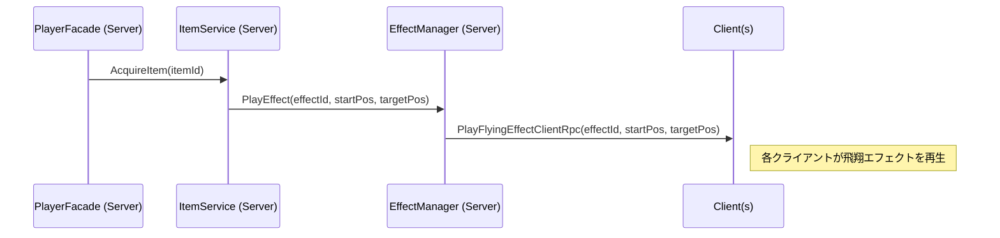

# **Effect & Audio 機能 設計ドキュメント**

## **1. 目的**

このドキュメントは、ゲーム内のサウンド（BGM, SFX）とビジュアルエフェクト（VFX）を管理・再生するための、堅牢で拡張性の高いシステム設計を定義します。

## **2. 実現したい演出リスト**

本システムが実現を目指す具体的な演出は以下の通りです。

### **2.1. BGM**
-   **シーン連動**: タイトル、メインメニュー、ゲーム中の各シーンで、適切なBGMが再生される。
-   **シームレスな遷移**: シーンをまたいでBGMが途切れない（例: メインメニューからゲームシーンへ）。
-   **動的変化**: ゲームの状況に応じてBGMが変化する。
    -   **低酸素時**: プレイヤーの酸素が一定値を下回ると、BGMのピッチと速度が上昇し、緊張感を煽る。

### **2.2. UIサウンド (SFX)**
-   ボタンのホバー時、クリック時にフィードバックとして効果音が再生される。

### **2.3. ゲームプレイサウンド (SFX)**
-   ゲーム開始時のカウントダウン音。
-   タイピング成功時、失敗時の効果音。
-   ブロック破壊時の効果音。

### **2.4. アイテムVFX & SFX**
-   **使用者**: アイテムを取得・使用したプレイヤーの位置でエフェクト・サウンドを再生。
-   **効果範囲**: 爆発系アイテムの場合、効果範囲内の各タイルでエフェクトを再生。
-   **対象者**: 妨害系アイテムの場合、効果を受けた相手プレイヤーの位置でエフェクト・サウンドを再生。
-   **飛翔演出**: 妨害系アイテム使用時、使用者から対象者へエフェクトが飛んでいく演出を追加する。

### **2.5. 画面エフェクト (VFX)**
-   **低酸素時**: プレイヤーのカメラに、画面の縁が赤く点滅するようなエフェクトを適用する。

---

## **3. アーキテクチャ: 永続的コアサービス**

本システムは、特定のシーンに依存しないアプリケーション全体の**コアサービス**として設計します。

-   **`AudioManager.cs` / `EffectManager.cs`**:
    -   **役割**: それぞれオーディオとVFXの再生を管理する責務を持つ、シングルトンなMonoBehaviour。
    -   **配置**: `Features/Core/Audio` および `Features/Core/VFX` フォルダに配置する。
    -   **永続化**: `App.unity`シーンでインスタンス化され、`DontDestroyOnLoad`によってアプリケーション終了まで破棄されない。これにより、シーン遷移をまたいだBGMの継続再生などを実現する。

## **4. データ管理: IDベースのレジストリ**

再生するアセット（AudioClip, VFX Prefab）をコードから直接参照するのではなく、IDを介して間接的に管理する**データ駆動設計**を採用します。

-   **`AudioRegistry.cs` / `VFXRegistry.cs` (ScriptableObject)**:
    -   **役割**: サウンドID/VFX IDと、それに対応するアセット（AudioClipやGameObjectプレハブ）のペアをリストとして保持する「カタログ」。
    -   **IDの形式**: `enum`または`string`を採用し、インスペクターから設定可能にする。
    -   **利点**: プログラマーがコードを変更することなく、サウンドデザイナーやアーティストがアセットの追加・差し替えを安全に行える。

## **5. 責務分担: サーバーRPC vs クライアントローカル**

いつ、誰がエフェクトやサウンドの再生をトリガーするかのルールを明確に定義します。

### **5.1. サーバーがトリガー (ClientRpc)**

-   **対象**: ゲームの論理的な状態変化に起因し、**全プレイヤーに同期されるべき演出**。
-   **例**:
    -   アイテムの効果発動（爆発、妨害）
    -   ブロックの破壊
    -   ゲームのグローバルイベント（開始、終了）
-   **フロー**: サーバーサイドのロジック（`ItemService`など）が`EffectManager.PlayEffectClientRpc(effectId, position)`のようなRPCを呼び出し、全クライアントに再生を命令する。

### **5.2. クライアントがトリガー (ローカル)**

-   **対象**: **ローカルプレイヤーの状態や入力にのみ依存**し、他のプレイヤーと同期する必要がない演出。
-   **例**:
    -   UIボタンのクリック音
    -   低酸素時のBGM変化や画面エフェクト
-   **フロー**: クライアントサイドのロジック（`InGameHUDManager`など）が、ローカルの`PlayerData`を監視し、条件を満たした際にローカルの`AudioManager`や`EffectManager`のメソッドを直接呼び出す。
-   **利点**: サーバーへの不要な通信を削減し、プレイヤーの操作に対する応答性を向上させる。

## **6. シーケンス図**

### **フロー①：妨害アイテム使用時 (サーバーRPC)**

### **フロー②：低酸素状態 (クライアントローカル)**
## **7. AudioListener戦略: ローカルプレイヤー追従**

2D画面分割ゲームにおける3Dオーディオの複雑さを回避しつつ、Unityの「複数のAudioListenerが存在します」という警告を解決するため、以下の戦略を採用します。

-   **設計思想**: 各クライアント（プレイヤー）は、「自分が見ている画面」に対応した音を聞くべきである。
-   **実装**:
    -   **`CameraManager`の責務**: `CameraManager`は、カメラのレイアウトを設定する際に、各カメラが追従している`PlayerFacade`がローカルプレイヤー（`IsOwner`が`true`）か否かを判定します。
    -   **動的な有効化**: ローカルプレイヤーを写すカメラの`AudioListener`コンポーネントのみを有効化（`enabled = true`）し、他の全プレイヤーのカメラのリスナーは無効化（`enabled = false`）します。
-   **効果**:
    -   各クライアントのシーン内では、常に単一の`AudioListener`のみが有効になるため、警告が解消されます。
    -   プレイヤーは、自分自身の画面（ビューポート）を基準とした、直感的で正しいサウンド（左右のパンニングなど）を体験できます。
    -   `WorldOffset`によるプレイヤー間の大きな物理的距離を気にする必要がなくなります。
