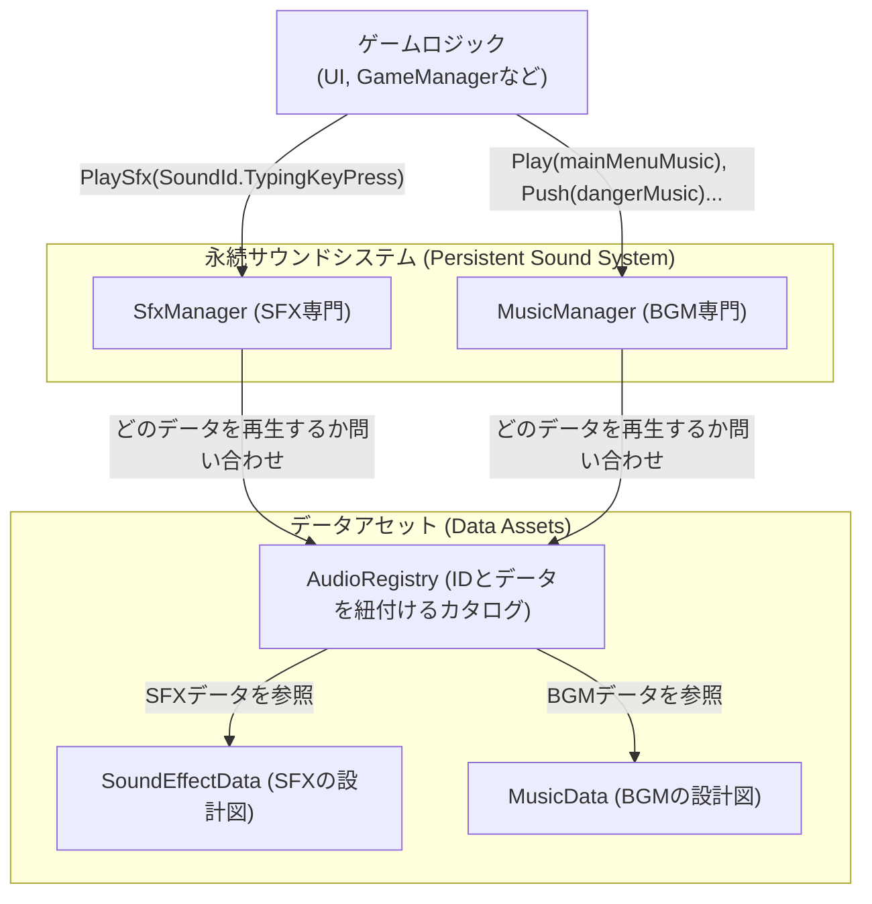

# **Effect & Audio 機能 設計ドキュメント**

## **1. 目的**

このドキュメントは、ゲーム内のサウンド（BGM, SFX）とビジュアルエフェクト（VFX）を管理・再生するための、堅牢で拡張性の高いシステム設計を定義します。

特にサウンドシステムは、単純な再生機能だけでなく、将来の拡張（サウンドの着せ替えショップなど）にも柔軟に対応できる、高度なデータ駆動設計を採用します。

---

## **2. 設計思想**

*   **責務の分離 (Separation of Concerns):**
    *   単純な「撃ちっぱなし」でよい効果音（SFX）と、クロスフェードやスタック管理といった複雑な状態を持つBGMのロジックを、**`SfxManager`**と**`MusicManager`**という完全に別のクラスに分離します。
*   **データ駆動設計 (Data-Driven Design):**
    *   「どの音を、どのように再生するか」という振all舞いの定義を、コードから**ScriptableObjectアセット**に分離します。これにより、非プログラマーでも安全かつ自由にサウンドの調整が可能になります。

---

## **3. システム構成**

---

## **4. 効果音 (SFX) システム: `SfxManager`**

### **4.1. 責務**
効果音（SFX）の再生に特化します。状態を持たない「ファイア・アンド・フォーゲット」方式です。

### **4.2. データ: `SoundEffectData.cs` (ScriptableObject)**
個々のSFXの振る舞いを定義するアセットです。
*   `List<AudioClip> Clips`: 複数の音声クリップを登録でき、再生時にこの中からランダムに1つが選ばれます。
*   `bool RandomizePitch`: 再生時にピッチをランダム化するかを設定します。
*   `float MinPitch`, `float MaxPitch`: ピッチのランダム化範囲を指定します。
*   `float Volume`: 再生音量。

### **4.3. API**
*   `PlaySfx(SoundId id)`: 指定されたIDに対応する`SoundEffectData`の定義に従って、効果音を1回再生します。
*   `PlaySfxAtPoint(SoundId id, Vector3 position)`: 3D空間の特定の位置でSFXを再生します。

---

## **5. BGMシステム: `MusicManager`**

### **5.1. 責務**
BGMの複雑な遷移（クロスフェード、スタック管理、ジングル再生）を一手に引き受けます。

### **5.2. データ: `MusicData.cs` (ScriptableObject)**
個々のBGMトラックを定義するアセットです。
*   `AudioClip Clip`: BGMの音声クリップ。
*   `float Volume`: 再生音量。
*   `bool Loop`: ループ再生するか。

### **5.3. 内部構造**
*   **2つのターンテーブル:** 2つの`AudioSource`を内部に持ち、片方を再生しながらもう片方で次の曲を準備することで、スムーズなクロスフェードを実現します。
*   **BGMスタック:** BGMの再生履歴をスタックで管理し、「一時的なBGMを再生し、終わったら元のBGMに戻る」といった処理を可能にします。

### **5.4. API**
*   **`Play(MusicData music, float fadeDuration)`:**
    *   **役割:** **マスターコマンド**。現在の再生状況（スタック、ジングル、フェードなど）を**全て中断・リセット**し、指定された`music`を最優先で再生します。フェード時間0を指定すれば即座に切り替わります。シーン遷移時に最適です。
*   **`Push(MusicData temporaryMusic, float fadeDuration)`:**
    *   **役割:** 現在のBGMをスタックに積み、一時的な`temporaryMusic`を上に重ねて再生します。（例: 危険地帯BGM）
*   **`Pop(float fadeDuration)`:**
    *   **役割:** スタックの一番上のBGMを終了し、一つ前のBGMにクロスフェードで戻ります。（例: 危険地帯から脱出）
*   **`PlayJingleThen(MusicData jingle, MusicData nextMusic, float fadeDuration)`:**
    *   **役割:** `jingle`（ループしない`MusicData`）を再生し、**その再生が完了したのを待ってから**、自動的に`nextMusic`へクロスフェードで繋ぐ、一連のシーケンスを実行します。（例: リザルト画面の演出）

---

## **6. ビジュアルエフェクト (VFX) システム: `EffectManager`**

VFXシステムは、SFXと同様のデータ駆動設計を基本としつつ、多様なゲーム内演出に対応するため、複数の再生方式を提供します。

### **6.1. 責務**
`EffectManager`は、サーバーからの指示に基づき、全クライアントで同期されたビジュアルエフェクトを再生する責務を持ちます。

### **6.2. データ: `VFXRegistry.cs`**
`VFXId`というEnumと、VFXのプレハブを紐付ける「カタログ」アセットです。`EffectManager`は、このレジストリを通じて再生すべきプレハブを取得します。

### **6.3. APIと機能拡張**

#### **方式①: シンプル再生 (Fire-and-Forget)**
特定の位置で一度だけ再生される、最も基本的なエフェクトです。

*   **API**: `PlayEffect(VFXId id, Vector3 position, float scale = 1.0f)`
*   **用途**: ブロック破壊、アイテム取得時のシンプルな光など。
*   **備考**: 既存の実装です。

#### **方式②: 指向性・可変スケール再生 (Directional & Scalable)**
ロケットのように、特定の方向と長さを持つエフェクトを実現するための拡張です。

*   **API (拡張)**: `PlayEffect(VFXId id, Vector3 position, Quaternion rotation, Vector3 scale)`
*   **用途**: ロケット、レーザーなど。
*   **実装**:
    *   `EffectManager`に、回転(`Quaternion`)とスケール(`Vector3`)を引数に取る`PlayEffect`のオーバーロードを追加します。
    *   `ItemEffect`（例: `DirectionalDestroyEffect`）は、エフェクトの進行方向から`rotation`を、効果範囲の長さから`scale`を算出して`EffectManager`に渡します。
    *   VFXプレハブ側は、`Particle System`の`Shape`モジュールなどを調整し、スケール変更に対応できるように作成します。

#### **方式③: 持続・追従再生 (Persistent & Attached)**
スターの無敵状態のように、特定のオブジェクトに追従し、指定時間表示され続けるエフェクトを実現します。

*   **API (新規)**: `PlayAttachedEffect(VFXId id, Transform target, float duration)`
*   **用途**: スターの無敵オーラ、サンダーの気絶エフェクトなど。
*   **実装**:
    1.  **`VFXAutoDestroyWithDuration.cs`**: 指定された`duration`（秒）が経過すると自身を破棄する、新しいコンポーネントを作成します。
    2.  **`EffectManager`の拡張**:
        *   `PlayAttachedEffect`メソッドを新設します。
        *   このメソッドは、クライアントサイドで`target`（プレイヤーなど）の子オブジェクトとしてVFXプレハブを生成し、`VFXAutoDestroyWithDuration`コンポーネントを追加して`duration`を設定します。
    *   `ItemEffect`（例: `StarEffect`）は、効果を適用する対象の`Transform`と効果時間`duration`を`EffectManager`に渡します。

---
*（旧ドキュメントの「AudioListener戦略」などの項目は、この設計と競合しないため、必要に応じてこの下に維持されます）*
