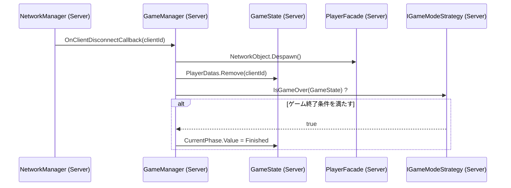
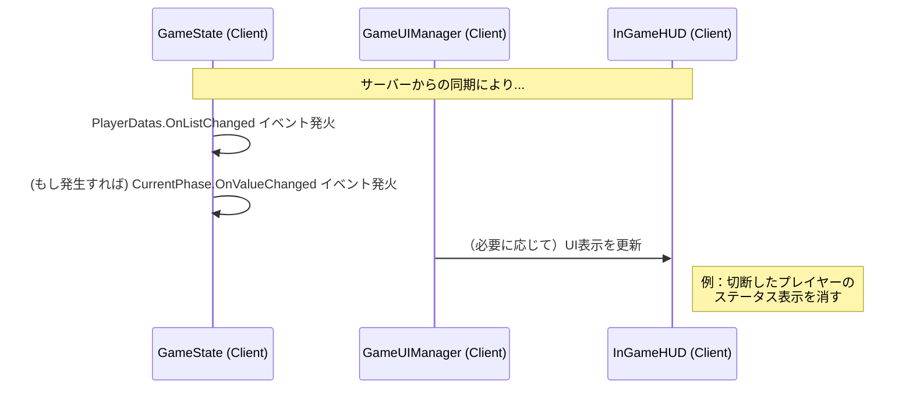
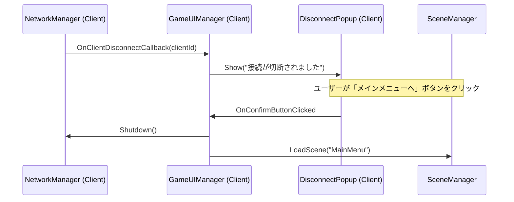

# **クライアント切断時の総合的な処理フロー**

このドキュメントは、クライアントがゲームセッションから切断された際の、サーバーとクライアント双方の挙動と責務を定義する。

## 1. 設計原則

*   **サーバー権威:** ゲームの状態（勝敗、続行/終了）に関する全ての決定権はサーバーが持つ。
*   **単一責任:** 各クラスは、自身の責務範囲内の処理のみを行う。
*   **明確なフィードバック:** プレイヤーには、何が起こったのかを明確に通知する。

## 2. ケーススタディ

### ケースA: サーバーがクライアントの切断を検知した場合

これは、クライアントが意図的に退出した、あるいはクライアント側のネットワーク問題でタイムアウトした場合に発生する。

#### 2.1. サーバーサイドのフロー

*   **責務:**
    *   **`GameManager`:**
        1.  `OnClientDisconnectCallback`を購読し、切断を検知する。
        2.  切断したプレイヤーの`PlayerFacade`をDespawnする。
        3.  `GameState`からプレイヤーデータを削除する。
        4.  `IGameModeStrategy`に問い合わせ、ゲームの続行可否を判断し、必要なら`GamePhase`を`Finished`に更新する。

#### 2.2. 残ったクライアントのフロー

*   **責務:**
    *   **各種UIコンポーネント:** `NetworkList`や`NetworkVariable`の変更イベントを購読し、サーバーから送られてきた最新の状態を画面に反映するだけ。

---

### ケースB: クライアントがサーバーとの接続断を検知した場合

これは、サーバー自体がダウンした、あるいはクライアントとサーバー間のネットワーク経路に問題が発生した場合に発生する。

#### 2.1. クライアントサイドのフロー

*   **責務:**
    *   **`GameUIManager`:**
        1.  クライアント側の`OnClientDisconnectCallback`を購読し、接続断を検知する。
        2.  切断通知UIを表示し、ユーザーからの入力を待つ。
        3.  ユーザーの確認後、`NetworkManager.Shutdown()`を呼び出してセッションを安全に終了し、`MainMenu`シーンへ遷移する。
