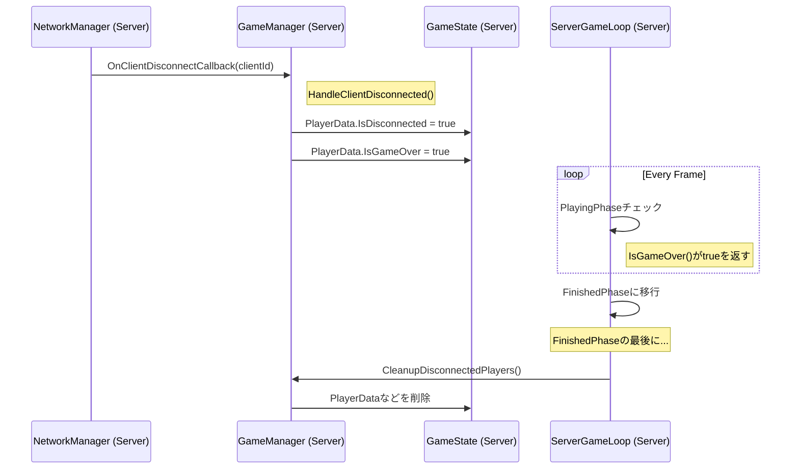
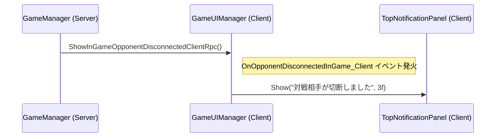
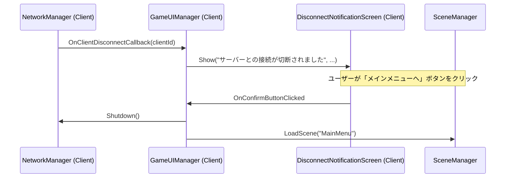

# クライアント切断時の総合的な処理フロー

このドキュメントは、クライアントがゲームセッションから切断された際の、サーバーとクライアント双方の挙動と責務を定義する。

## 1. 設計原則

-   **サーバー権威:** ゲームの状態（勝敗、続行/終了）に関する全ての決定権はサーバーが持つ。
-   **責務の分離:** イベントハンドラは状態の変更のみを行い、ゲームのメインループが状態に基づいてフェーズ遷移を判断する。
-   **明確なフィードバック:** プレイヤーには、何が起こったのかを明確に通知する。

## 2. ケーススタディ

### ケースA: サーバーがクライアントの切断を検知した場合

これは、クライアントが意図的に退出した、あるいはクライアント側のネットワーク問題でタイムアウトした場合に発生する。

#### 2.1. サーバーサイドのフロー

-   **責務:**
    -   **`GameManager`:**
        1.  `OnClientDisconnectCallback`を購読し、切断を検知する。
        2.  `GameState`内の該当`PlayerData`の`IsDisconnected`と`IsGameOver`フラグを`true`に更新する。状態変更のみに責任を持つ。
        3.  ゲームのメインループ(`ServerGameLoop`)からの指示で、`FinishedPhase`の最後に切断済みプレイヤーの情報をクリーンアップする。
    -   **`ServerGameLoop`:**
        1.  毎フレーム`IGameModeStrategy.IsGameOver()`をチェックし、ゲーム終了を検知する。
        2.  ゲーム終了を検知したら、`PlayingPhase`を終了し、`FinishedPhase`に移行する責務を持つ。

#### 2.2. 残ったクライアントのフロー

-   **責務:**
    -   **`GameUIManager`:** サーバーからのRPCを受け取り、`TopNotificationPanel`に短時間の通知を表示する。

---

### ケースB: クライアントがサーバーとの接続断を検知した場合

これは、サーバー自体がダウンした、あるいはクライアントとサーバー間のネットワーク経路に問題が発生した場合に発生する。

#### 2.1. クライアントサイドのフロー

-   **責務:**
    -   **`GameUIManager`:**
        1.  クライアント側の`OnClientDisconnectCallback`を購読し、接続断を検知する。
        2.  操作をブロックする`DisconnectNotificationScreen`を表示し、ユーザーからの入力を待つ。
        3.  ユーザーの確認後、`NetworkManager.Shutdown()`を呼び出してセッションを安全に終了し、`MainMenu`シーンへ遷移する。