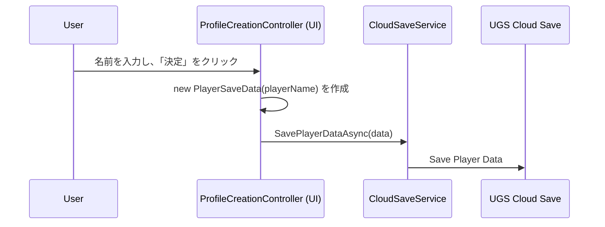
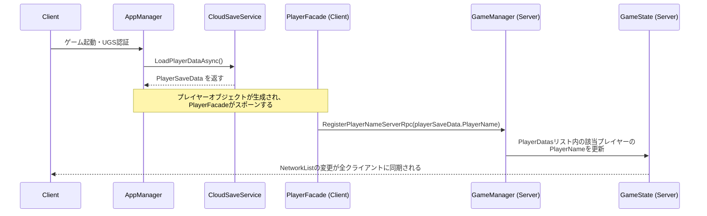
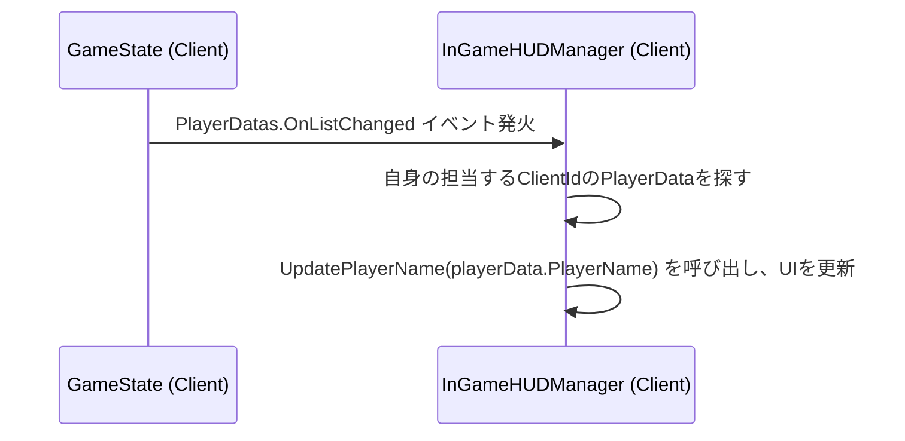

# **プレイヤーID設計ドキュメント**

## 1. 目的

このドキュメントは、ゲーム内でのプレイヤーの識別情報（特にプレイヤー名）が、どのように設定・保存され、ゲームセッション内で他プレイヤーに伝達されるかのデータフローと設計を定義します。

## 2. 設計思想

*   **単一の信頼できる情報源 (Single Source of Truth)**: プレイヤーに関する永続的な情報（プレイヤー名、設定など）は、Unity Gaming Services (UGS) の **Cloud Save** に保存されている `PlayerSaveData` オブジェクトを唯一のマスターデータとします。
*   **クライアントの責任**: プレイヤー名は、クライアント自身が責任を持ってCloud Saveから読み込み、サーバーに通知します。サーバーは、他プレイヤーのCloud Saveデータを直接読み書きすることはありません。
*   **ゲーム内での同期**: ゲームセッション中のプレイヤー名共有は、`GameState`内の`NetworkList<PlayerData>`を介して行われます。これにより、途中参加や切断があった場合でも、全クライアントが常に最新のプレイヤーリストを参照できます。

## 3. データ構造

### 3.1. `PlayerSaveData` (Cloud Save用)

永続化されるプレイヤーのプロフィールデータです。

```csharp
[System.Serializable]
public class PlayerSaveData
{
    public string PlayerName; // プレイヤーが設定した名前
    public PlayerSettingsData Settings; // 音量などの設定
    public PlayerProgressData Progress; // ハイスコアなどの進捗
}
```

### 3.2. `PlayerData` (ゲーム内同期用)

`GameState`内の`NetworkList`で管理される、ゲームセッション中のプレイヤー状態です。

```csharp
public struct PlayerData : INetworkSerializable
{
    public ulong ClientId;
    public NetworkString64Bytes PlayerName; // 固定長の文字列型で名前を同期
    public float Oxygen;
    // ... その他のゲーム内ステータス
}
```

## 4. データフロー

### フロー①: 初回プレイヤー名設定



### フロー②: ゲーム参加時の名前同期



### フロー③: HUDでの名前表示


