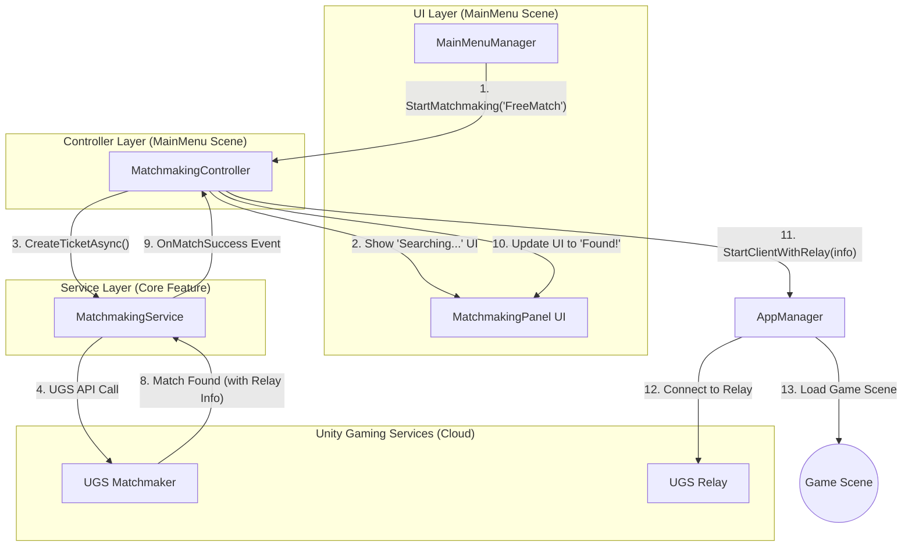
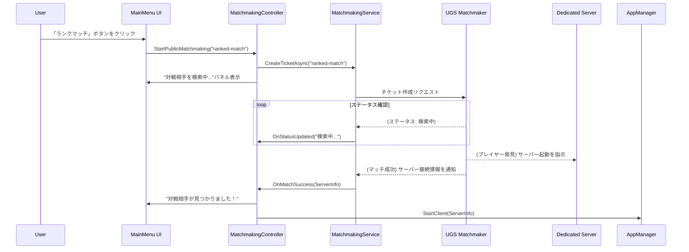
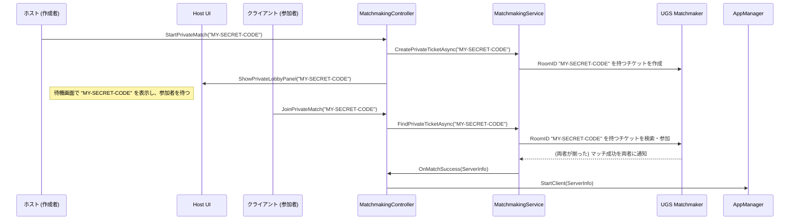

# **Matchmaking機能 設計ドキュメント**

## **1. 責務と目的**

このドキュメントは、Unity Gaming Services (UGS) の **Matchmaker** と **Relay** を利用した、オンラインマルチプレイのマッチング機能全体の設計を定義します。

**目的:**

*   **関心の分離**: UGSとの複雑な通信ロジックをUIから完全に分離し、テストと保守が容易な構造を実現する。
*   **堅牢なフロー**: フリーマッチ、ランクマッチ、合言葉マッチ（プライベートマッチ）の全てに対応し、タイムアウト、キャンセル、エラー発生時にも安定したユーザー体験を提供する。
*   **既存アーキテクチャとの調和**: `AppManager` をサービスロケーターとして利用し、`MainMenu`シーン内でUIとロジックが連携する、既存の設計思想を踏襲する。

---

## **2. システム構成図**

マッチング機能は、UI層、コントローラー層、サービス層の3層に明確に分離されます。

---

## **3. 主要コンポーネント**

### **3.1. `MatchmakingService.cs` (サービス層)**

*   **配置場所**: `Assets/_Project/Features/Core/Matchmaking/Scripts/`
*   **役割**: UGS MatchmakerおよびRelayとの通信を全て担当する、UIに依存しないプレーンなC#クラス。`AppManager`によってシングルトンとして管理されます。
*   **責務**:
    *   `CreateTicketAsync(playerProfile, queueName)`: マッチングチケットを作成する。
    *   `CheckTicketStatusAsync()`: 定期的にチケットのステータスを確認する。
    *   `CancelMatchmaking()`: 現在のチケットを削除する。
    *   `JoinByCodeAsync(joinCode)`: Relayのルームに合言葉で参加する。
    *   **イベント**:
        *   `OnMatchSuccess(MatchResult result)`: マッチング成功時にRelayの接続情報と共に発行される。
        *   `OnMatchFailure(string reason)`: マッチング失敗時に発行される。
        *   `OnStatusUpdated(string status)`: UI表示用のステータス更新通知。

### **3.2. `MatchmakingController.cs` (コントローラー層)**

*   **配置場所**: `Assets/_Project/Features/UI/Screens/MainMenu/Scripts/`
*   **役割**: `MainMenuManager`からの指示と`MatchmakingService`のイベントを仲介し、UIの状態を制御する。
*   **責務**:
    *   `StartMatchmaking(queueName)`: フリーマッチやランクマッチの開始をトリガーする。
    *   `StartPrivateMatch()`: ホストとしてプライベートマッチ用のRelayルームを作成する。
    *   `JoinPrivateMatch(joinCode)`: 合言葉でプライベートマッチに参加する。
    *   `Cancel()`: 進行中の全てのマッチング処理をキャンセルする。
    *   `MatchmakingService`からのイベントを購読し、`MatchmakingPanel`のテキストを「検索中...」「対戦相手が見つかりました」「ルームを作成中...」のように更新する。
    *   マッチング成功後、`AppManager`にRelay情報を渡してゲームシーンへの遷移を開始させる。

### **3.3. UIコンポーネント (UI層)**

*   **`MultiplayerModeSelectPanel`**: 「フリーマッチ」「ランクマッチ」「合言葉マッチ」のボタンを持つパネル。
*   **`MatchmakingPanel`**: マッチング中のステータスを表示し、「キャンセル」ボタンを持つパネル。
*   **`RoomCodePanel`**: 「ルーム作成」「ルーム参加」の選択肢と、合言葉の入力フィールドを持つパネル。

---

## 4. データフロー

### **フロー①: 公開マッチング (フリー / ランク)**

### **フロー②: プライベートマッチ (合言葉)**

このフローでは、Matchmakerを「特定の合言葉を持つプレイヤー同士を引き合わせる」ためだけに使います。

---

## 5. UGSキューとゲームモード

本プロジェクトのマッチングは、UGS Matchmakerの**キュー(Queue)**を使い分けることで、異なるゲーム体験を提供します。

*   **`free-match`キュー:** レートの変動がない、気軽なフリーマッチ用のキューです。
*   **`ranked-match`キュー:** レートの変動がある、真剣勝負用のキューです。

クライアントは、選択したモードに応じて、`MatchmakingService`に適切なキュー名を渡してチケットを作成します。Matchmakerは、同じキューにいるプレイヤー同士を引き合わせ、Game Server Hostingに適切なゲームモード（例: `-gameMode RankedMatch`）を伝えて専用サーバーを起動させます。

---

## 6. 実装ステップ

1.  **UGS SDKの導入**: `com.unity.services.matchmaker` と `com.unity.services.relay` パッケージをプロジェクトに追加する。
2.  **`MatchmakingService`の実装**: UGSのドキュメントを参考に、チケット作成、ステータス確認、Relayのホスト/参加などの非同期メソッドを実装する。
3.  **`MatchmakingController`の実装**: `MatchmakingService`をラップし、UIからの入力を受け付けてサービスを呼び出し、サービスからのイベントに応じてUIを更新するロジックを実装する。
4.  **UIパネルの作成と連携**: `MainMenu`シーンに各UIパネルを作成し、`MainMenuManager`と`MatchmakingController`から制御できるように接続する。
5.  **`AppManager`の拡張**: Relay情報を受け取って`UnityTransport`に設定し、`StartHost()` / `StartClient()` を呼び出すメソッドを追加する。
