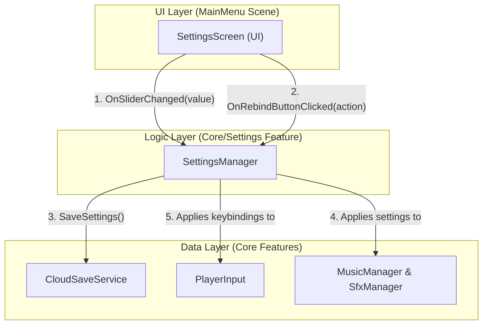

# **Settings機能 設計ドキュメント**

## **1. 目的**

このドキュメントは、プレイヤーがゲーム体験をカスタマイズできるようにするための、以下の2つのコア機能の設計を定義します。

*   **音量バランス調整機能**: BGM（背景音楽）とSFX（効果音）の音量バランスを個別に調整できるようにする。
*   **キーコンフィグ機能**: プレイヤーが移動やインタラクションに使用するキーを自由に変更できるようにする。

これらの設定は、Unity Gaming Services (UGS) のCloud Saveを利用して永続化されます。

---

## **2. フォルダ構造**

この機能はゲーム全体に影響するコア機能であるため、関連するすべてのスクリプトとアセットは、新しく作成する以下のフォルダに配置します。

*   `Assets/_Project/Features/Core/Settings/`

---

## **3. データ構造の変更**

設定値を保存するため、`PlayerSaveData.cs` 内の `PlayerSettingsData` クラスを以下のように拡張します。

**ファイル:** `Assets/_Project/Features/Core/CloudSave/Scripts/PlayerSaveData.cs`

```csharp
[System.Serializable]
public class PlayerSettingsData
{
    // 既存のフィールド
    public float MasterVolume = 1.0f;

    // --- 新規追加フィールド ---
    [Range(0.0f, 1.0f)]
    public float BgmVolume = 0.8f; // BGM専用の音量

    [Range(0.0f, 1.0f)]
    public float SfxVolume = 1.0f; // SFX専用の音量

    public string KeybindingsOverrideJson; // キーバインドの変更をJSON形式で保存
}
```

---

## **4. システム構成と設計**



### **4.1. `SettingsManager.cs` (ロジック層)**

*   **役割**: 設定機能全体のロジックを管理するシングルトンクラス。UIとデータ層を仲介します。
*   **責務**:
    *   現在の設定値 (`PlayerSettingsData`) を保持する。
    *   UIからの変更要求を受け付け、`PlayerSettingsData`を更新する。
    *   `CloudSaveService`を呼び出して、設定データを保存・ロードする。
    *   音量設定の変更を通知するイベント (`OnBgmVolumeChanged`, `OnSfxVolumeChanged`) を発行する。
    *   `PlayerInput`の`GameControls`インスタンスに、キーバインドのオーバーライドを適用する。

### **4.2. 音量調整機能**

*   **`MusicManager.cs` / `SfxManager.cs` の修正**:
    *   これらのマネージャは、起動時に`SettingsManager`から現在のBGM/SFX音量を取得し、購読します。
    *   サウンドを再生する際、最終的な音量を `(個別アセットのVolume) * (SettingsManagerのVolume)` のように計算して適用します。
    *   例えば、`SfxManager`の`PlaySfx`は以下のようになります。
        ```csharp
        // 擬似コード
        public void PlaySfx(SoundId sfxId)
        {
            var sfxData = _registry.GetSfxData(sfxId);
            // ...
            float finalVolume = sfxData.Volume * _settingsManager.SfxVolume;
            _sfxSource.PlayOneShot(clip, finalVolume);
        }
        ```

### **4.3. キーコンフィグ機能**

*   **リバインド処理**:
    *   `SettingsManager`は、UnityのInput Systemが提供する `InputActionRebindingExtensions.PerformInteractiveRebinding` を利用して、インタラクティブなキー再設定プロセスを開始します。
    *   UI上の「変更」ボタンが押されると、`SettingsManager`がこのプロセスを呼び出し、ユーザーの次の入力を待ち受けます。
*   **保存と復元**:
    *   全てのリバインドが完了した後、`SettingsManager`は `_gameControls.SaveBindingOverridesAsJson()` を呼び出して変更差分をJSON文字列として取得し、`PlayerSettingsData.KeybindingsOverrideJson` に保存します。
    *   ゲーム起動時、`SettingsManager`は`CloudSaveService`からロードした`PlayerSettingsData`を取得し、`_gameControls.LoadBindingOverridesFromJson(loadedJson)` を呼び出して、保存されたキー設定を復元します。

### **4.4. `SettingsScreen.cs` (UI層)**

*   **役割**: メインメニューシーンに表示される設定画面のUIを制御します。
*   **責務**:
    *   BGMとSFXの音量を調整するためのスライダーを持つ。
    *   各入力アクション（上、下、左、右、インタラクト）の現在のキーバインドを表示し、「変更」ボタンを提供する。
    *   UIの変更を検知し、`SettingsManager`に対応するメソッドを呼び出す。
    *   「保存して戻る」「デフォルトに戻す」ボタンを提供する。

---
