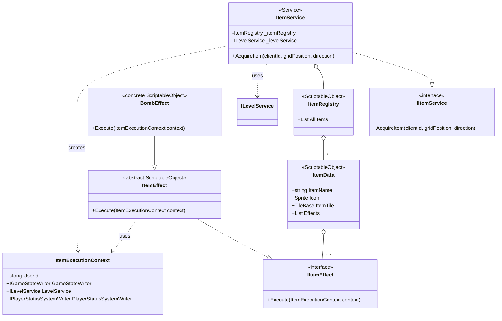

# Item機能 クラス図

このドキュメントは、`Item`機能に関連する主要なクラスとその関係性を示したものです。

```mermaid
classDiagram
    class ItemService {
        <<Service>>
        -ItemRegistry _itemRegistry
        -ILevelService _levelService
        +AcquireItem(clientId, gridPosition, direction)
    }

    class IItemService {
        <<interface>>
        +AcquireItem(clientId, gridPosition, direction)
    }

    class ItemData {
        <<ScriptableObject>>
        +string ItemName
        +Sprite Icon
        +TileBase ItemTile
        +List<IItemEffect> Effects
    }

    class IItemEffect {
        <<interface>>
        +Execute(ItemExecutionContext context)
    }

    class ItemEffect {
        <<abstract ScriptableObject>>
        +Execute(ItemExecutionContext context)
    }

    class BombEffect {
        <<concrete ScriptableObject>>
        +Execute(ItemExecutionContext context)
    }

    class ItemExecutionContext {
        +ulong UserId
        +IGameStateWriter GameStateWriter
        +ILevelService LevelService
        +IPlayerStatusSystemWriter PlayerStatusSystemWriter
    }

    class ItemRegistry {
        <<ScriptableObject>>
        +List<ItemData> AllItems
    }

    ItemService ..|> IItemService
    ItemService o-- ItemRegistry
    ItemService ..> ILevelService : uses
    ItemService ..> ItemExecutionContext : creates

    ItemData o-- "1..*" IItemEffect

    ItemEffect ..|> IItemEffect
    BombEffect --|> ItemEffect

    ItemEffect ..> ItemExecutionContext : uses

    ItemRegistry o-- "*" ItemData

```
