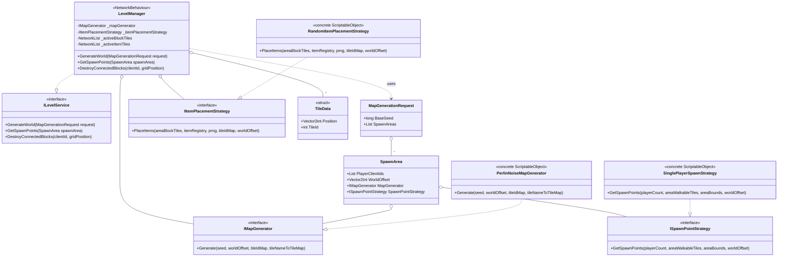

# Level機能 クラス図

このドキュメントは、`Level`機能に関連する主要なクラスとその関係性を示したものです。

```mermaid
classDiagram
    class LevelManager {
        <<NetworkBehaviour>>
        -IMapGenerator _mapGenerator
        -IItemPlacementStrategy _itemPlacementStrategy
        -NetworkList<TileData> _activeBlockTiles
        -NetworkList<TileData> _activeItemTiles
        +GenerateWorld(MapGenerationRequest request)
        +GetSpawnPoints(SpawnArea spawnArea)
        +DestroyConnectedBlocks(clientId, gridPosition)
    }

    class ILevelService {
        <<interface>>
        +GenerateWorld(MapGenerationRequest request)
        +GetSpawnPoints(SpawnArea spawnArea)
        +DestroyConnectedBlocks(clientId, gridPosition)
    }

    class MapGenerationRequest {
        +long BaseSeed
        +List<SpawnArea> SpawnAreas
    }

    class SpawnArea {
        +List<ulong> PlayerClientIds
        +Vector2Int WorldOffset
        +IMapGenerator MapGenerator
        +ISpawnPointStrategy SpawnPointStrategy
    }

    class IMapGenerator {
        <<interface>>
        +Generate(seed, worldOffset, tileIdMap, tileNameToTileMap)
    }

    class PerlinNoiseMapGenerator {
        <<concrete ScriptableObject>>
        +Generate(seed, worldOffset, tileIdMap, tileNameToTileMap)
    }

    class IItemPlacementStrategy {
        <<interface>>
        +PlaceItems(areaBlockTiles, itemRegistry, prng, tileIdMap, worldOffset)
    }

    class RandomItemPlacementStrategy {
        <<concrete ScriptableObject>>
        +PlaceItems(areaBlockTiles, itemRegistry, prng, tileIdMap, worldOffset)
    }

    class ISpawnPointStrategy {
        <<interface>>
        +GetSpawnPoints(playerCount, areaWalkableTiles, areaBounds, worldOffset)
    }

    class SinglePlayerSpawnStrategy {
        <<concrete ScriptableObject>>
        +GetSpawnPoints(playerCount, areaWalkableTiles, areaBounds, worldOffset)
    }

    class TileData {
        <<struct>>
        +Vector3Int Position
        +int TileId
    }

    LevelManager ..|> ILevelService
    LevelManager o-- IMapGenerator
    LevelManager o-- IItemPlacementStrategy
    LevelManager o-- "*" TileData
    LevelManager ..> MapGenerationRequest : uses

    MapGenerationRequest o-- "*" SpawnArea
    SpawnArea o-- IMapGenerator
    SpawnArea o-- ISpawnPointStrategy

    PerlinNoiseMapGenerator ..|> IMapGenerator
    RandomItemPlacementStrategy ..|> IItemPlacementStrategy
    SinglePlayerSpawnStrategy ..|> ISpawnPointStrategy

```
