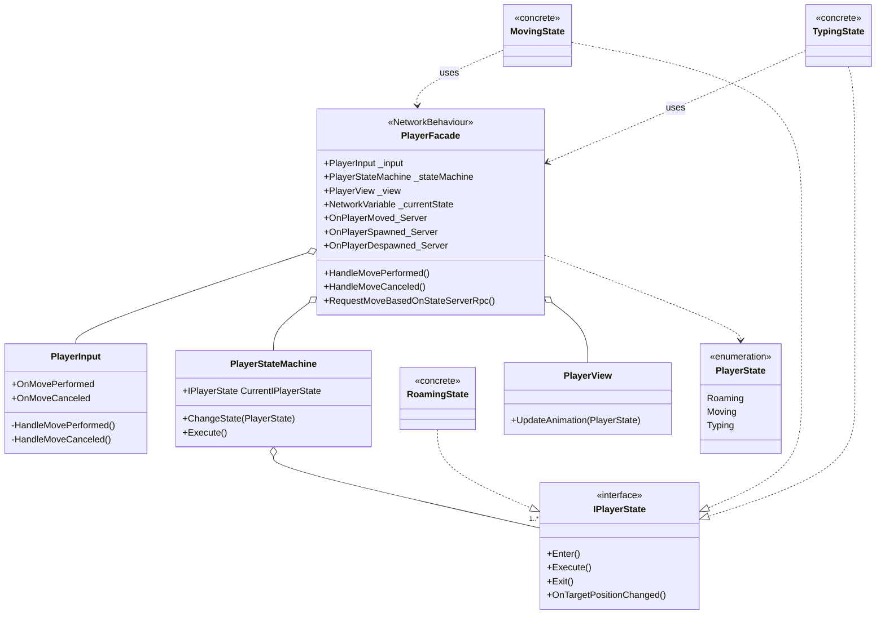

# Player機能 クラス図

このドキュメントは、`Player`機能に関連する主要なクラスとその関係性を示したものです。

```mermaid
classDiagram
    class PlayerFacade {
        <<NetworkBehaviour>>
        +PlayerInput _input
        +PlayerStateMachine _stateMachine
        +PlayerView _view
        +NetworkVariable<PlayerState> _currentState
        +OnPlayerMoved_Server
        +OnPlayerSpawned_Server
        +OnPlayerDespawned_Server
        +HandleMovePerformed()
        +HandleMoveCanceled()
        +RequestMoveBasedOnStateServerRpc()
    }

    class PlayerInput {
        +OnMovePerformed
        +OnMoveCanceled
        -HandleMovePerformed()
        -HandleMoveCanceled()
    }

    class PlayerStateMachine {
        +IPlayerState CurrentIPlayerState
        +ChangeState(PlayerState)
        +Execute()
    }

    class IPlayerState {
        <<interface>>
        +Enter()
        +Execute()
        +Exit()
        +OnTargetPositionChanged()
    }

    class RoamingState {
        <<concrete>>
    }
    class MovingState {
        <<concrete>>
    }
    class TypingState {
        <<concrete>>
    }

    class PlayerView {
        +UpdateAnimation(PlayerState)
    }

    class PlayerState {
        <<enumeration>>
        Roaming
        Moving
        Typing
    }

    PlayerFacade o-- PlayerInput
    PlayerFacade o-- PlayerStateMachine
    PlayerFacade o-- PlayerView
    PlayerFacade ..> PlayerState

    PlayerStateMachine o-- "1..*" IPlayerState

    RoamingState ..|> IPlayerState
    MovingState ..|> IPlayerState
    TypingState ..|> IPlayerState
    
    MovingState ..> PlayerFacade : uses
    TypingState ..> PlayerFacade : uses

```
