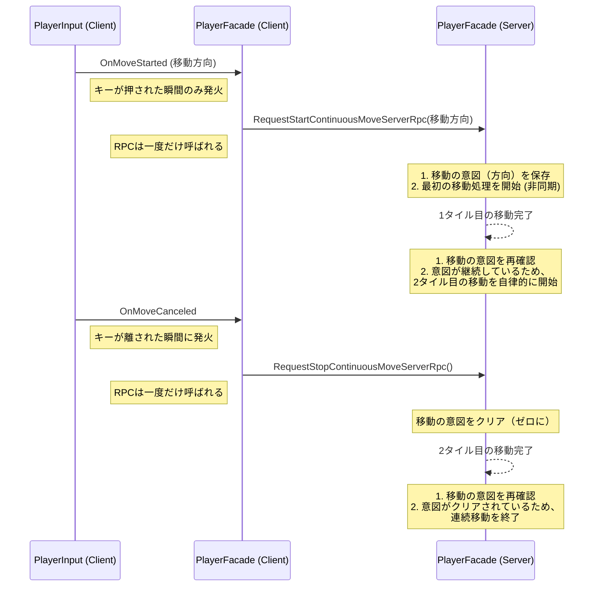
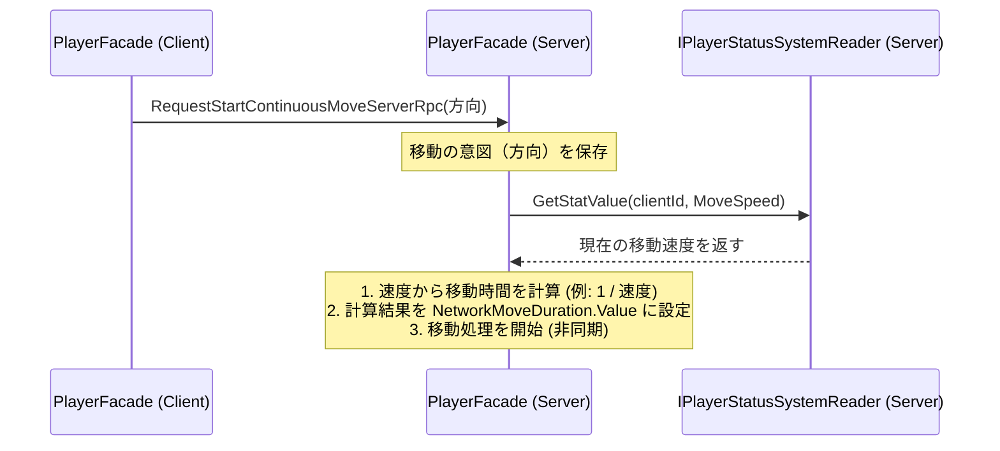
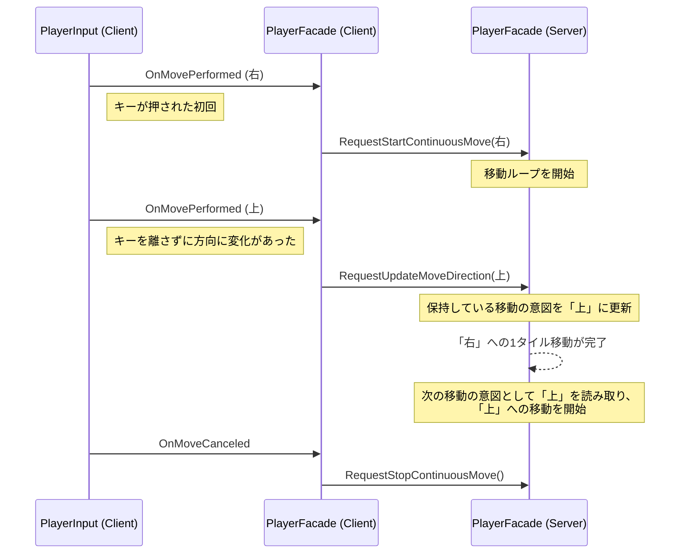

# **Player機能 設計ドキュメント - 長押しによる連続移動フロー**

このドキュメントは、プレイヤーがキーを長押しした際に、キャラクターがスムーズに連続移動するロジックの設計について詳述します。

## **1. 設計目標**

*   **ネットワーク効率の最大化**: クライアントからサーバーへのRPC呼び出しを最小限に抑え、ネットワーク帯域の圧迫を防ぐ。
*   **サーバー権威の維持**: 移動の最終的な判断と実行は全てサーバーが行うことで、チート耐性を確保する。
*   **高い応答性**: プレイヤーの入力に対して、遅延を感じさせないスムーズな移動を実現する。

## **2. 設計思想: 「意図」の同期**

本設計の中核は、移動のアクションそのもの（「1フレーム前に進め」）を毎フレーム送信するのではなく、**プレイヤーの「移動したい」という継続的な意図**をサーバーと同期させる点にあります。

*   クライアントは、キーが**押された瞬間**と**離された瞬間**のみをサーバーに通知します。
*   サーバーは、クライアントから通知された「移動の意図（方向）」を内部に保持します。
*   サーバーは、一度移動が完了するたびに、保持している「意図」を再確認し、意図が継続していれば、**クライアントからの次の指示を待たずに**自律的に次の移動を開始します。

## **3. シーケンス図**

以下に、プレイヤーがキーを長押しし、2タイル分移動した後にキーを離すまでの、クライアントとサーバー間のやり取りを示します。

## **4. 各コンポーネントの責務**

### **4.1. `PlayerInput.cs` (Client)**

*   UnityのInput Systemの `started` と `canceled` イベントを利用します。
*   `OnMoveStarted(Vector2 direction)`: キーが押された瞬間に、移動方向と共にイベントを発行します。
*   `OnMoveCanceled()`: キーが離された瞬間にイベントを発行します。

### **4.2. `PlayerFacade.cs` (Client)**

*   `PlayerInput`からのイベントを購読します。
*   `OnMoveStarted` を受け取ると `RequestStartContinuousMoveServerRpc(direction)` を呼び出します。
*   `OnMoveCanceled` を受け取ると `RequestStopContinuousMoveServerRpc()` を呼び出します。

### **4.3. `PlayerFacade.cs` (Server)**

*   `private Vector3Int _continuousMoveDirection_Server;` のような変数を持ち、クライアントの現在の移動の意図を保持します。
*   **`RequestStartContinuousMoveServerRpc`**:
    1.  引数で受け取った方向を `_continuousMoveDirection_Server` に保存します。
    2.  もし現在移動中でなければ、最初の移動処理（ステートを`Moving`に変更し、移動完了コルーチンを開始する）をトリガーします。
*   **`RequestStopContinuousMove-ServerRpc`**:
    1.  `_continuousMoveDirection_Server` を `Vector3Int.zero` にリセットします。
*   **`FinishMovement_Server` (移動完了コルーチン)**:
    1.  1タイル分の移動が完了するのを待ちます。
    2.  `_continuousMoveDirection_Server` を確認します。
    3.  もし `zero` でなければ、保存されている方向に向かって、再度移動処理をトリガーします。
    4.  もし `zero` であれば、ステートを `Roaming` に戻して連続移動を終了します。

---
**関連ドキュメント:**
* [Player-Design.md](./Player-Design.md)

## **5. 動的な移動速度への対応**

将来的にプレイヤーがアイテム取得などによって「移動速度」ステータスを強化できることを見据え、移動時間を動的に計算する設計を導入します。

### **5.1. 設計思想**

*   **サーバー権威**: 移動時間の計算は、サーバーサイドの `PlayerStatusSystem` が持つステータス値を基に、サーバーのみが行います。
*   **動的な時間計算**: 「移動速度」は「1秒あたりの移動タイル数」と定義し、1タイルあたりの移動時間 (`moveDuration`) はその逆数 (`1 / moveSpeed`) として計算されます。
*   **クライアントへの同期**: サーバーが計算した `moveDuration` は `NetworkVariable<float>` を通じて全クライアントに同期されます。これにより、クライアントはサーバーと完全に同じ時間で移動アニメーションを再生できます。

### **5.2. 処理フローの更新**

`RequestStartContinuousMoveServerRpc` を受け取った際のサーバーの処理が以下のように拡張されます。

### **5.3. 各コンポーネントの責務（追記）**

#### **`PlayerFacade.cs` (Server)**

*   `IPlayerStatusSystemReader` への参照を保持します。
*   移動要求を受け取るたびに、`IPlayerStatusSystemReader.GetStatValue()` を呼び出して現在の移動速度を取得します。
*   取得した速度から移動時間を算出し、`NetworkVariable<float> NetworkMoveDuration` を更新します。
*   移動完了を待つコルーチンでは、この `NetworkMoveDuration.Value` を使用します。

#### **`MovingState.cs` (Client / Server)**

*   `Enter` メソッド内で、`PlayerFacade` が公開する `NetworkMoveDuration.Value` を自身の移動時間として設定します。これにより、サーバーが決定した通りの速度でアニメーションが再生されます。

## **6. 移動中の方向転換と斜め移動**

操作性を向上させるため、プレイヤーが移動を停止することなくシームレスに方向転換できる機能と、8方向（斜め含む）への移動を実装します。

### **6.1. 設計思想: 「方向更新」の意図を追加**

既存の「開始」「停止」の意図に加え、「**移動方向の更新**」という第3の意図を導入します。

*   **クライアント**: `PlayerInput`の`performed`イベントを利用し、入力が**開始**されたか、**変化**したかを検知します。クライアントの`PlayerFacade`は、自身が持つフラグ (`_isMoveInputHeld`) を基に、これが「開始」なのか「方向更新」なのかを判断し、それぞれ異なるRPCをサーバーに送信します。
*   **サーバー**: 新しい`RequestUpdateMoveDirectionServerRpc`を受け取ると、サーバーが保持している移動の意図（方向）を更新します。サーバーの移動実行ループは、次の移動タイミングでこの更新された方向を自然に読み取り、移動を継続します。

### **6.2. シーケンス図（更新版）**

右に移動開始後、キーを上にスライドして方向転換するフロー。

### **6.3. 斜め移動の考慮**

*   **入力**: クライアントは、`Vector2`の入力値を正規化し、最も近い8方向の`Vector3Int`に丸めてからサーバーに送信します。
*   **移動時間**: サーバーは、移動方向が斜め（xとyが両方0でない）の場合、計算した移動時間に`√2`（約1.414）を乗算し、移動距離の長さを補正します。

### **6.4. 各コンポーネントの責務（更新版）**

#### **`PlayerInput.cs` (Client)**

*   `OnMoveStarted`を`OnMovePerformed(Vector2 direction)`に改名し、`Input System`の`performed`イベントを購読します。このイベントは、入力の初回と、値が変化するたびに発火します。

#### **`PlayerFacade.cs` (Client)**

*   `private bool _isMoveInputHeld;` フラグを持ち、クライアント側の入力状態を管理します。
*   `OnMovePerformed` を受け取った際:
    *   `_isMoveInputHeld`が`false`なら「開始」と判断し、`RequestStartContinuousMoveServerRpc`を呼び出します。
    *   `_isMoveInputHeld`が`true`なら「方向更新」と判断し、`RequestUpdateMoveDirectionServerRpc`を呼び出します。
*   `OnMoveCanceled` を受け取った際:
    *   `_isMoveInputHeld`を`false`に戻し、`RequestStopContinuousMoveServerRpc`を呼び出します。

#### **`PlayerFacade.cs` (Server)**

*   新しいRPC `RequestUpdateMoveDirectionServerRpc(Vector3Int newDirection)` を持ち、`_continuousMoveDirection_Server`変数を更新する責務を負います。
*   `ContinuousMove_Server`コルーチンは、移動時間を計算する際に、方向が斜めであれば時間を`* 1.414f`します。
