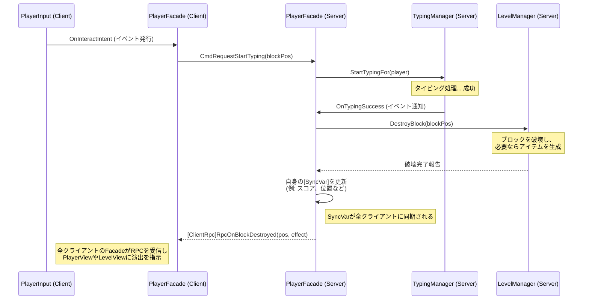

```mermaid
sequenceDiagram
    participant C_Input as PlayerInput (Client)
    participant C_Facade as PlayerFacade (Client)
    participant S_Facade as PlayerFacade (Server)
    participant S_Typing as TypingManager (Server)
    participant S_Level as LevelManager (Server)

    C_Input->>C_Facade: OnInteractIntent (イベント発行)
    C_Facade->>S_Facade: CmdRequestStartTyping(blockPos)
    S_Facade->>S_Typing: StartTypingFor(player)
    Note over S_Typing: タイピング処理... 成功
    S_Typing->>S_Facade: OnTypingSuccess (イベント通知)
    S_Facade->>S_Level: DestroyBlock(blockPos)
    Note over S_Level: ブロックを破壊し、<br/>必要ならアイテムを生成
    S_Level-->>S_Facade: 破壊完了報告
    S_Facade->>S_Facade: 自身の[SyncVar]を更新<br>(例: スコア、位置など)
    Note right of S_Facade: SyncVarが全クライアントに同期される
    S_Facade-->>C_Facade: [ClientRpc]RpcOnBlockDestroyed(pos, effect)
    Note left of C_Facade: 全クライアントのFacadeがRPCを受信し<br/>PlayerViewやLevelViewに演出を指示
```