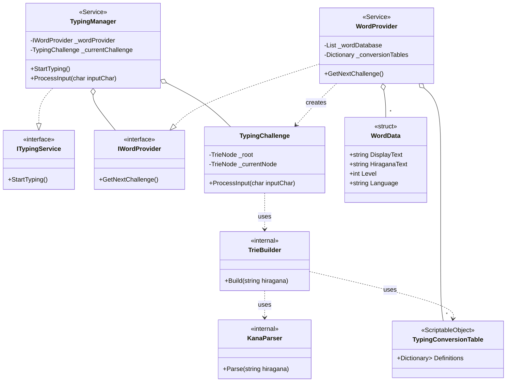

# Typing機能 クラス図

このドキュメントは、`Typing`機能に関連する主要なクラスとその関係性を示したものです。

```mermaid
classDiagram
    class TypingManager {
        <<Service>>
        -IWordProvider _wordProvider
        -TypingChallenge _currentChallenge
        +StartTyping()
        +ProcessInput(char inputChar)
    }

    class ITypingService {
        <<interface>>
        +StartTyping()
    }

    class WordProvider {
        <<Service>>
        -List<WordData> _wordDatabase
        -Dictionary<string, TypingConversionTable> _conversionTables
        +GetNextChallenge()
    }

    class IWordProvider {
        <<interface>>
        +GetNextChallenge()
    }

    class TypingChallenge {
        -TrieNode _root
        -TrieNode _currentNode
        +ProcessInput(char inputChar)
    }

    class TrieBuilder {
        <<internal>>
        +Build(string hiragana)
    }

    class KanaParser {
        <<internal>>
        +Parse(string hiragana)
    }

    class TypingConversionTable {
        <<ScriptableObject>>
        +Dictionary<string, List<string>> Definitions
    }

    class WordData {
        <<struct>>
        +string DisplayText
        +string HiraganaText
        +int Level
        +string Language
    }

    TypingManager ..|> ITypingService
    TypingManager o-- IWordProvider
    TypingManager o-- TypingChallenge

    WordProvider ..|> IWordProvider
    WordProvider o-- "*" WordData
    WordProvider o-- "*" TypingConversionTable
    WordProvider ..> TypingChallenge : creates

    TypingChallenge ..> TrieBuilder : uses
    TrieBuilder ..> KanaParser : uses
    TrieBuilder ..> TypingConversionTable : uses

```
