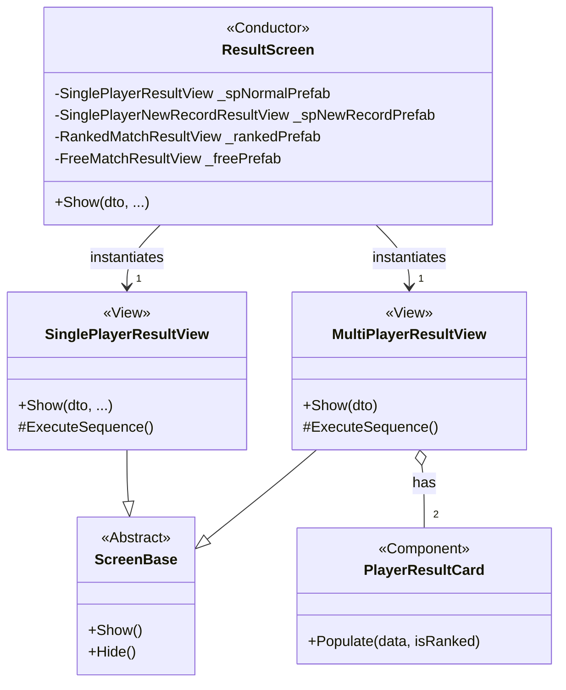

# **リザルト画面 新技術設計書**

## 1. 目的

ユーザーからのフィードバックに基づき、リザルト画面のアーキテクチャを全面的に刷新する。本設計は、以下の要件を満たすことを目的とする。

*   **レイアウトの完全な分離**: シングルプレイ、ランクマッチ、フリーマッチなど、モードごとに全く異なるUIレイアウトを、互いに干渉することなく表示できる。
*   **責務の明確化**: 各クラスが単一の責任を持つ、クリーンでモジュール化された構造を実現する。
*   **アニメーション制御**: HTMLプロトタイプで示された、加算的なアニメーションと、それをスキップする機能を実装する。
*   **一貫性**: プロジェクトの既存のUIアーキテクチャ（`ScreenBase`の活用）に準拠する。

## 2. アーキテクチャ概要

「Prefab差し替え方式」を採用する。司令塔となる`ResultScreen`が、状況に応じた「View」のPrefabを`Instantiate`し、実際の表示やアニメーションは各Viewコンポーネントが責任を持つ。

## 3. クラス図

## 4. 各コンポーネントの責務詳細

### 4.1. `ResultScreen.cs` (司令塔)
*   **役割**: どのViewを表示するかの決定と生成にのみ責任を持つ。
*   **フィールド**:
    *   各モードに対応するViewのPrefabへの参照（例: `_singlePlayerNewRecordPrefab`）。
*   **主要メソッド**:
    *   `Show(GameResultDto dto, ...)`:
        1.  `dto`とキャッシュされたデータ（自己ベストなど）を基に、どのView (Prefab) を使うべきかを判断する。
        2.  既存のViewがあれば破棄する。
        3.  判断結果に基づき、適切なPrefabを`Instantiate`する。
        4.  生成したViewの`Show(...)`メソッドを呼び出し、データを渡す。

### 4.2. `SinglePlayerResultView.cs` (シングルプレイ画面)
*   **継承**: `ScreenBase`
*   **役割**: シングルプレイのリザルト表示と、その演出シーケンス全体に責任を持つ。
*   **フィールド**:
    *   自身のレイアウトに必要なUI要素（`_timeText`, `_bestTimeText`, `_newRecordBanner`など）への参照。
    *   演出スキップ用の`_skipButton`への参照。
*   **主要メソッド**:
    *   `Show(GameResultDto dto, ...)`:
        1.  `base.Show()`を呼び出し、自身のルートをフェードインさせる。
        2.  受け取ったデータで各UIテキストを初期化する（`PrepareUIContent`）。
        3.  アニメーションコルーチン`ExecuteSequence()`を開始する。
    *   `ExecuteSequence()`:
        1.  `_skipButton`を有効化する。
        2.  `yield return WaitOrSkip(duration)`を挟みながら、各パネル（`CanvasGroup`）を順番にフェードインさせる。
        3.  シーケンス完了後、`_skipButton`を無効化する。
    *   `WaitOrSkip()`: 待機時間とスキップボタンのクリックを監視するヘルパーコルーチン。

### 4.3. `MultiPlayerResultView.cs` (マルチプレイ画面)
*   **継承**: `ScreenBase`
*   **役割**: マルチプレイのリザルト表示と演出に責任を持つ。
*   **フィールド**:
    *   左右2つの`PlayerResultCard`コンポーネントへの参照。
    *   演出スキップ用の`_skipButton`への参照。
*   **主要メソッド**:
    *   `Show(GameResultDto dto)`:
        1.  `base.Show()`を呼び出す。
        2.  `dto`からランクマッチか否かを判断する。
        3.  各`PlayerResultCard`の`Populate(...)`メソッドを呼び出し、プレイヤーデータとランクマッチ情報を渡す。
        4.  アニメーションコルーチン`ExecuteSequence()`を開始する。

### 4.4. `PlayerResultCard.cs` (プレイヤーカード)
*   **継承**: `MonoBehaviour`
*   **役割**: プレイヤー一人分の統計情報を表示することに責任を持つ。
*   **フィールド**:
    *   `_playerNameText`, `_wpmText`, `_ratingSection`など、カード内の全UI要素への参照。
*   **主要メソッド**:
    *   `Populate(PlayerData data, bool isRanked, ...)`:
        1.  受け取ったデータで各テキストを埋める。
        2.  `isRanked`フラグに基づき、`_ratingSection`の表示/非表示を切り替える。
