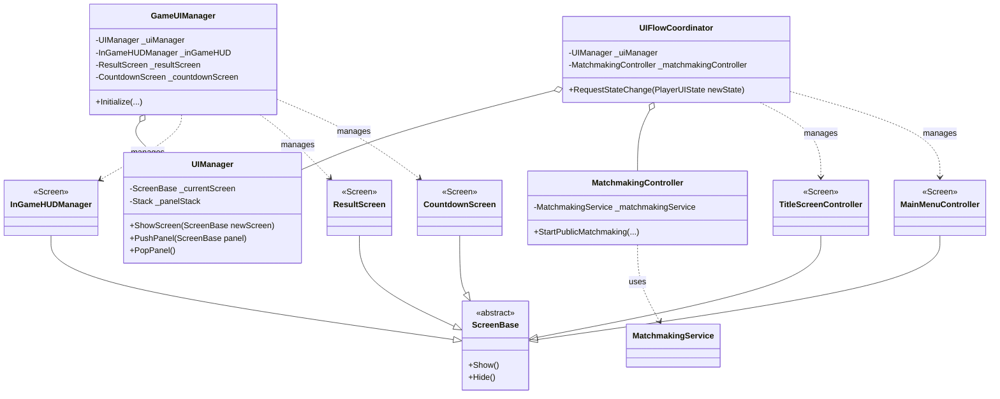

# UI機能 クラス図

このドキュメントは、`UI`機能に関連する主要なクラスとその関係性を示したものです。

```mermaid
classDiagram
    class UIManager {
        -ScreenBase _currentScreen
        -Stack<ScreenBase> _panelStack
        +ShowScreen(ScreenBase newScreen)
        +PushPanel(ScreenBase panel)
        +PopPanel()
    }

    class UIFlowCoordinator {
        -UIManager _uiManager
        -MatchmakingController _matchmakingController
        +RequestStateChange(PlayerUIState newState)
    }

    class GameUIManager {
        -UIManager _uiManager
        -InGameHUDManager _inGameHUD
        -ResultScreen _resultScreen
        -CountdownScreen _countdownScreen
        +Initialize(...)
    }

    class ScreenBase {
        <<abstract>>
        +Show()
        +Hide()
    }

    class InGameHUDManager {
        <<Screen>>
    }

    class ResultScreen {
        <<Screen>>
    }

    class CountdownScreen {
        <<Screen>>
    }

    class TitleScreenController {
        <<Screen>>
    }

    class MainMenuController {
        <<Screen>>
    }

    class MatchmakingController {
        -MatchmakingService _matchmakingService
        +StartPublicMatchmaking(...)
    }

    UIFlowCoordinator o-- UIManager
    UIFlowCoordinator o-- MatchmakingController
    UIFlowCoordinator ..> TitleScreenController : manages
    UIFlowCoordinator ..> MainMenuController : manages

    GameUIManager o-- UIManager
    GameUIManager ..> InGameHUDManager : manages
    GameUIManager ..> ResultScreen : manages
    GameUIManager ..> CountdownScreen : manages

    InGameHUDManager --|> ScreenBase
    ResultScreen --|> ScreenBase
    CountdownScreen --|> ScreenBase
    TitleScreenController --|> ScreenBase
    MainMenuController --|> ScreenBase

    MatchmakingController ..> MatchmakingService : uses

```
