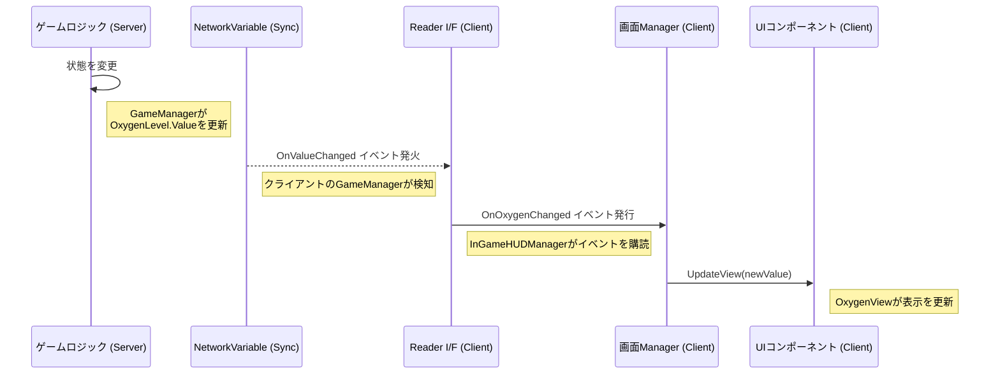

# **UI機能 設計ドキュメント**

## **1\. 設計思想**

UIシステムの設計は\*\*「UIは“愚かな”ビューであるべき」\*\*という原則に基づきます。UIはゲームの状態を表示し、ユーザー入力を通知する以上の責任を持つべきではありません。

* **一方向データフロー**: データの流れは常に「ゲームロジック → UI」の一方向に限定します。UIがゲームの状態を直接書き換えることはありません。  
* **疎結合**: UIコンポーネントは、GameManagerやPlayerといったゲームロジックの具体的なクラスを一切知りません。Readerインターフェースを通じてのみデータを受け取ります。  
* **責務の分割**: UI全体を管理する「画面Manager」と、個々の部品（ゲージ、ラベルなど）を管理する「自己完結型コンポーネント」に役割を分割します。

## **2\. 主要コンポーネント**

### **2.1. GameUIManager.cs (UIの司令塔)**

* **役割**: `Game`シーン全体のUIの状態を管理する唯一の司令塔。
* **責務**:
  * `InGameHUD`, `ResultScreen`, `CountdownUI`など、シーンに存在するUIスクリーンへの参照をインスペクターから保持します。
  * `IGameStateReader`の`CurrentPhaseNV`イベントを購読します。
  * `GamePhase`の変更を検知し、現在のフェーズに合ったUIスクリーンのみを表示し、他を非表示にする責務を持ちます。
  * `ResultScreen`のボタンクリックのようなUIからのイベントを購読し、`GameManager`へのRPC呼び出しなど、適切なゲームロジックへの通知に変換します。

### **2.2. UIスクリーン / コンポーネント (例: ResultScreen.cs, OxygenView.cs)**

* **役割**: `ResultScreen`のような画面単位のUIや、`OxygenView`のような単一責務のUI部品。これらはもはや`Manager`である必要はありません。
* **責務**:
  * 自身の見た目（Slider, Buttonなど）への参照を保持します。
  * 外部（`GameUIManager`）から呼び出されるための公開メソッド（例: `Show(string message)`, `UpdateView(float value)`)と、外部が購読するためのC#イベント（例: `OnRematchClicked`）を持ちます。
  * 渡されたデータに基づいて自身の見た目を更新したり、ユーザーの入力をイベントとして通知することにのみ責任を持ちます。

## **3\. データ更新のフロー**

ゲームの状態が変更され、UIの表示が更新されるまでの流れは以下のようになります。

この一方向のデータフローにより、UIのロジックは非常にシンプルかつ予測可能になり、デバッグや仕様変更が容易になります。

**関連ドキュメント:**

* [../Game/Gameplay/Gameplay-Design.md](../Game/Gameplay/Gameplay-Design.md)  
* [../Architecture-Overview.md](../../Architecture-Overview.md)