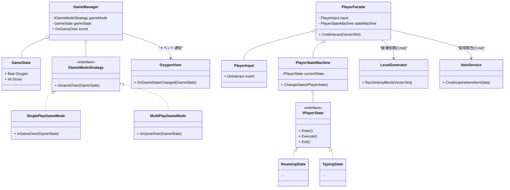
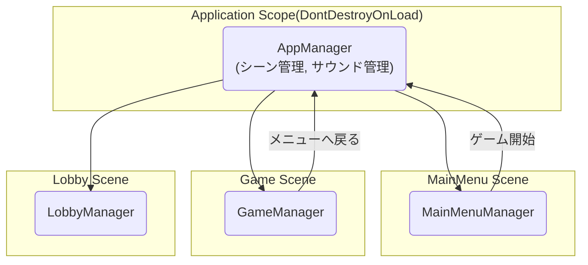

# 設計
## クラス図

## 全体設計


# フォルダ戦略
```
Assets
├── 📂_Project                  # ✅ プロジェクト固有のアセットは全てここに
│   ├── 📂Features              # ⭐ プロジェクトの心臓部。機能単位で管理
│   │   ├── 📂Core                # アプリケーション全体の基盤機能
│   │   │   ├── 📂SceneManagement # シーン遷移
│   │   │   ├── 📂Sound           # サウンド管理
│   │   │   └── 📂DI              # DIコンテナの設定など
│   │   │
│   │   ├── 📂Game                # ゲームプレイ中の機能
│   │   │   ├── 📂Player
│   │   │   │   ├── 📂Prefabs
│   │   │   │   ├── 📂Scripts
│   │   │   │   └── 📂Animations
│   │   │   ├── 📂Items           # 💎 アイテム関連はここに集約
│   │   │   │   ├── 📂Data          # ScriptableObjectのアセット置き場
│   │   │   │   ├── 📂Icons         # アイテムのアイコン
│   │   │   │   ├── 📂Scripts
│   │   │   │   │   ├── Data        # ItemData.cs など定義クラス
│   │   │   │   │   └── Effects     # IItemEffect.cs や具体的な効果クラス
│   │   │   │   └── 📂Tiles         # タイルマップ用のアイテムタイル
│   │   │   ├── 📂Level
│   │   │   └── 📂Typing
│   │   │
│   │   ├── 📂Networking          # PlayFab, Mirror関連のスクリプト
│   │   └── 📂UI                  # UI関連
│   │       ├── 📂Screens         # 画面ごとのUIプレハブやスクリプト
│   │       │   ├── 📂MainMenu
│   │       │   ├── 📂Lobby
│   │       │   └── 📂InGameHUD
│   │       └── 📂Common          # 画面をまたいで使う共通UI部品
│   │           ├── 📂Buttons
│   │           └── 📂Fonts
│   │
│   ├── 📂Scenes                  # シーンファイル
│   │   ├── Title.unity
│   │   └── Game.unity
│   │
│   └── 📂Settings                # ゲーム全体の設定用ScriptableObject
│       ├── ItemRegistry.asset      # アイテムDBの実体
│       └── GameDBSettings.asset
│
├── 📂ExternalAssets            # Asset Storeなど外部アセット
└── 📂Editor                    # Editor拡張スクリプト
```

# 参考文献
    - マルチプレイ
        - あのゲームの作り方Web版
            - NetCode for GameObject
            - Game Server Hosting(Unity)