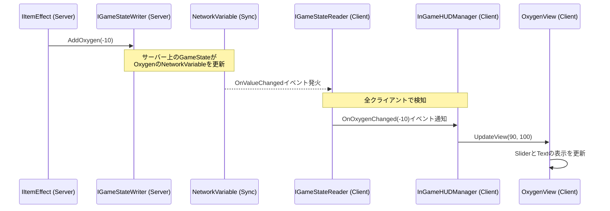

```mermaid
sequenceDiagram
    participant S_Effect as IItemEffect (Server)
    participant S_GameState as IGameStateWriter (Server)
    participant NV as NetworkVariable (Sync)
    participant C_GameState as IGameStateReader (Client)
    participant C_HUD as InGameHUDManager (Client)
    participant C_View as OxygenView (Client)

    S_Effect->>S_GameState: AddOxygen(-10)
    note over S_GameState, NV: サーバー上のGameStateが<br/>OxygenのNetworkVariableを更新
    NV-->>C_GameState: OnValueChangedイベント発火
    note over C_GameState, C_HUD: 全クライアントで検知
    C_GameState->>C_HUD: OnOxygenChanged(-10)イベント通知
    C_HUD->>C_View: UpdateView(90, 100)
    C_View->>C_View: SliderとTextの表示を更新
```