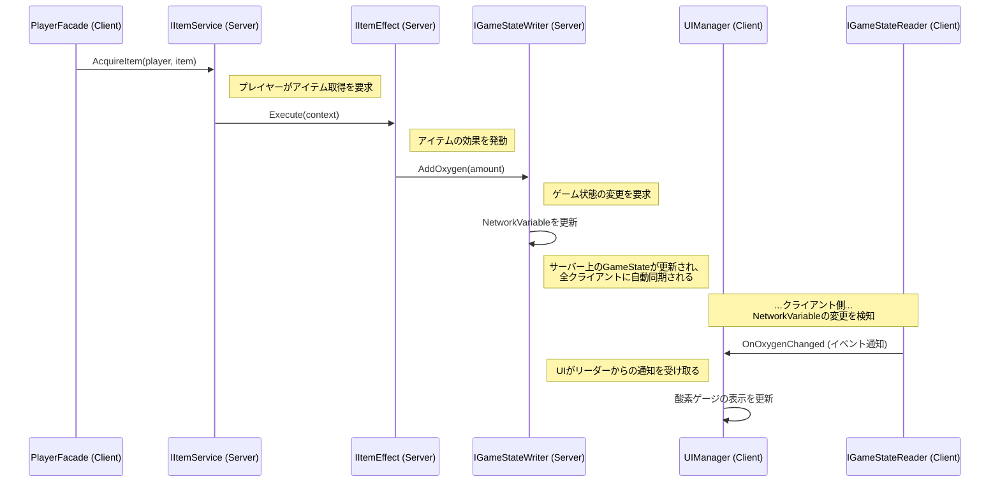

```mermaid
sequenceDiagram
    participant PlayerFacade as PlayerFacade (Client)
    participant ItemService as IItemService (Server)
    participant OxygenEffect as IItemEffect (Server)
    participant GameStateWriter as IGameStateWriter (Server)
    participant UIManager as UIManager (Client)
    participant GameStateReader as IGameStateReader (Client)

    PlayerFacade ->> ItemService: AcquireItem(player, item)
    note right of ItemService: プレイヤーがアイテム取得を要求

    ItemService ->> OxygenEffect: Execute(context)
    note right of OxygenEffect: アイテムの効果を発動

    OxygenEffect ->> GameStateWriter: AddOxygen(amount)
    note right of GameStateWriter: ゲーム状態の変更を要求

    GameStateWriter ->> GameStateWriter: NetworkVariableを更新
    note right of GameStateWriter: サーバー上のGameStateが更新され、<br/>全クライアントに自動同期される

    note over UIManager, GameStateReader: ...クライアント側...<br/>NetworkVariableの変更を検知

    GameStateReader ->> UIManager: OnOxygenChanged (イベント通知)
    note left of UIManager: UIがリーダーからの通知を受け取る

    UIManager ->> UIManager: 酸素ゲージの表示を更新
```